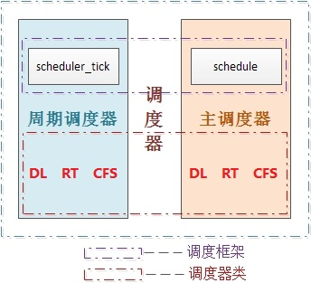

Linux进程退出详解
=======

| 日期 | 内核版本 | 架构| 作者 | GitHub| CSDN |
| ------- |:-------:|:-------:|:-------:|:-------:|:-------:|
| 2016-06-14 | [Linux-4.6](http://lxr.free-electrons.com/source/?v=4.6) | X86 & arm | [gatieme](http://blog.csdn.net/gatieme) | [LinuxDeviceDrivers](https://github.com/gatieme/LDD-LinuxDeviceDrivers) | [Linux进程管理与调度](http://blog.csdn.net/gatieme/article/category/6225543) |

#调度器概述
-------

内存中保存了对每个进程的唯一描述, 并通过若干结构与其他进程连接起来.

**调度器**面对的情形就是这样, 其任务是在程序之间共享CPU时间, 创造并行执行的错觉, 该任务分为两个不同的部分, 其中一个涉及**调度策略**, 另外一个涉及**上下文切换**.

##什么是调度器
-------

通常来说，操作系统是应用程序和可用资源之间的媒介。

典型的资源有内存和物理设备。但是CPU也可以认为是一个资源，调度器可以临时分配一个任务在上面执行（单位是时间片）。调度器使得我们同时执行多个程序成为可能，因此可以与具有各种需求的用户共享CPU。

内核必须提供一种方法, 在各个进程之间尽可能公平地共享CPU时间, 而同时又要考虑不同的任务优先级.

调度器的一个重要目标是有效地分配 CPU 时间片，同时提供很好的用户体验。调度器还需要面对一些互相冲突的目标，例如既要为关键实时任务最小化响应时间, 又要最大限度地提高 CPU 的总体利用率.

调度器的一般原理是, 按所需分配的计算能力, 向系统中每个进程提供最大的公正性, 或者从另外一个角度上说, 他试图确保没有进程被亏待.

##调度策略
-------

传统的Unix操作系统的都奥杜算法必须实现几个互相冲突的目标:

*	进程响应时间尽可能快

*	后台作业的吞吐量尽可能高

*	尽可能避免进程的饥饿现象

*	低优先级和高优先级进程的需要尽可能调和等等

调度策略(scheduling policy)的任务就是决定什么时候以怎么样的方式选择一个新进程占用CPU运行

传统操作系统的调度基于分时(time sharing)技术: 多个进程以"时间多路服用"方式运行, 因为CPU的时间被分成"片(slice)", 给每个可运行进程分配一片CPU时间片, 当然单处理器在任何给定的时刻只能运行一个进程.

如果当前可运行进程的时限(quantum)到期时(即时间片用尽), 而该进程还没有运行完毕, 进程切换就可以发生.

分时依赖于定时中断, 因此对进程是透明的, 不需要在承租中插入额外的代码来保证CPU分时.

调度策略也是根据进程的优先级对他们进行分类. 有时用复杂的算法求出进程当前的优先级, 但最后的结果是相同的: 每个进程都与一个值(优先级)相关联, 这个值表示把进程如何适当地分配给CPU.

在linux中, 进程的优先级是动态的. 调度程序跟踪进程正在做什么, 并周期性的调整他们的优先级. 在这种方式下, 在较长的时间间隔内没有任何使用CPU的进程, 通过动态地增加他们的优先级来提升他们. 相应地, 对于已经在CPU上运行了较长时间的进程, 通过减少他们的优先级来处罚他们.

##进程的分类
-------

当涉及有关调度的问题时, 传统上把进程分类为"I/O受限(I/O-dound)"或"CPU受限(CPU-bound)".

| 类型 | 别称 | 描述 | 示例 |
| ------- |:-------:|:-------:|:-------:|
| I/O受限型 | I/O密集型 | 频繁的使用I/O设备, 并花费很多时间等待I/O操作的完成 | 数据库服务器, 文本编辑器 |
| CPU受限型 | 计算密集型 | 花费大量CPU时间进行数值计算 | 图形绘制程序 |

另外一种分类法把进程区分为三类:

| 类型 | 描述 | 示例 |
| ------- |:-------:|:-------:|:-------:|
| 交互式进程(interactive process) | 此类进程经常与用户进行交互, 因此需要花费很多时间等待键盘和鼠标操作. 当接受了用户的输入后, 进程必须很快被唤醒, 否则用户会感觉系统反应迟钝 | shell, 文本编辑程序和图形应用程序 |
| 批处理进程(batch process) | 此类进程不必与用户交互, 因此经常在后台运行. 因为这样的进程不必很快相应, 因此常受到调度程序的怠慢 | 程序语言的编译程序, 数据库搜索引擎以及科学计算 |
| 实时进程(real-time process) | 这些进程由很强的调度需要, 这样的进程绝不会被低优先级的进程阻塞. 并且他们的响应时间要尽可能的短 | 视频音频应用程序, 机器人控制程序以及从物理传感器上收集数据的程序|

>**注意**
>
>前面的两类分类方法在一定程序上相互独立
>
>例如, 一个批处理进程很有可能是I/O受限的(如数据库服务器), 也可能是CPU受限的(比如图形绘制程序)

在linux中, 调度算法可以明确的确认所有实时进程的身份, 但是没办法区分交互式程序和批处理程序, linux2.6的调度程序实现了基于进程过去行为的启发式算法, 以确定进程应该被当做交互式进程还是批处理进程. 当然与批处理进程相比, 调度程序有偏爱交互式进程的倾向

#Linux的调度器组成
-------

**2个调度器**

可以用两种方法来激活调度

*	一种是直接的, 比如进程打算睡眠或出于其他原因放弃CPU

*	另一种是通过周期性的机制, 以固定的频率运行, 不时的检测是否有必要

因此当前linux的调度程序由两个调度器组成：**主调度器**，**周期性调度器**(两者又统称为**核心调度器**)

并且每个调度器包括两个内容：**调度框架**(其实质就是两个函数框架)及**调度器类**

调度器类是实现了不同调度策略的实例，如 CFS、RT class等。

它们的关系如下图

当前的内核支持两种调度器类（sched_setscheduler系统调用可修改进程的策略）：CFS（公平）、RT（实时）；5种调度策略：SCHED_NORAML（最常见的策略）、SCHED_BATCH（除了不能抢占外与常规任务一样，允许任务运行更长时间，更好地使用高速缓存，适合于成批处理的工作）、SCHED_IDLE（它甚至比nice 19还有弱，为了避免优先级反转使用）和SCHED_RR（循环调度，拥有时间片，结束后放在队列末）、SCHED_FIFO（没有时间片，可以运行任意长的时间）；其中前面三种策略使用的是cfs调度器类，后面两种使用rt调度器类。

**2个调度器类**

当前的内核支持2种调度器类（sched_setscheduler系统调用可修改进程的策略）：**CFS（公平调度器）**、**RT（实时调度器）**

**5种调度策略**

| 字段 | 描述 | 所在调度器类 |
| ------------- |:-------------:|:-------------:|
| SCHED_NORMAL | （也叫SCHED_OTHER）用于普通进程，通过CFS调度器实现。SCHED_BATCH用于非交互的处理器消耗型进程。SCHED_IDLE是在系统负载很低时使用 | CFS |
| SCHED_BATCH |  SCHED_NORMAL普通进程策略的分化版本。采用分时策略，根据动态优先级(可用nice()API设置），分配CPU运算资源。注意：这类进程比上述两类实时进程优先级低，换言之，在有实时进程存在时，实时进程优先调度。但针对吞吐量优化, 除了不能抢占外与常规任务一样，允许任务运行更长时间，更好地使用高速缓存，适合于成批处理的工作 | CFS |
| SCHED_IDLE | 优先级最低，在系统空闲时才跑这类进程(如利用闲散计算机资源跑地外文明搜索，蛋白质结构分析等任务，是此调度策略的适用者）| CFS |
| SCHED_FIFO | 先入先出调度算法（实时调度策略），相同优先级的任务先到先服务，高优先级的任务可以抢占低优先级的任务 | RT |
| SCHED_RR | 轮流调度算法（实时调度策略），后者提供 Roound-Robin 语义，采用时间片，相同优先级的任务当用完时间片会被放到队列尾部，以保证公平性，同样，高优先级的任务可以抢占低优先级的任务。不同要求的实时任务可以根据需要用sched_setscheduler()API 设置策略 | RT |
| SCHED_DEADLINE | 新支持的实时进程调度策略，针对突发型计算，且对延迟和完成时间高度敏感的任务适用。基于Earliest Deadline First (EDF) 调度算法|

其中前面三种策略使用的是cfs调度器类，后面两种使用rt调度器类。

另外，对于调度框架及调度器类，它们都有自己管理的运行队列，调度框架只识别rq（其实它也不能算是运行队列），而对于cfs调度器类它的运行队列则是cfs_rq（内部使用红黑树组织调度实体），实时rt的运行队列则为rt_rq（内部使用优先级bitmap+双向链表组织调度实体）

##linux早期的调度器
-------

在linux-2.6版本的内核之前, 当很多任务都处于活动状态时, 调度器有很明显的限制。

这是由于调度器是使用一个复杂度为$O(n)$的算法实现的。

在这种调度器中, 调度任务所花费的时间是一个系统中任务个数的函数. 换而言之, 活动的任务越多, 调度任务所花费的时间越长. 在任务负载非常重时, 处理器会因调度消耗掉大量的时间, 用于任务本身的时间就非常少了。因此，这个算法缺乏可伸缩性

在对称多处理系统（SMP）中，2.6 版本之前的调度器对所有的处理器都使用一个运行队列。这意味着一个任务可以在任何处理器上进行调度 —— 这对于负载均衡来说是好事，但是对于内存缓存来说却是个灾难。例如，假设一个任务正在 CPU-1 上执行，其数据在这个处理器的缓存中。如果这个任务被调度到 CPU-2 上执行，那么数据就需要先在 CPU-1 使其无效，并将其放到 CPU-2 的缓存中。
以前的调度器还使用了一个运行队列锁；因此在 SMP 系统中，选择一个任务执行就会阻碍其他处理器操作这个运行队列。结果是空闲处理器只能等待这个处理器释放出运行队列锁，这样会造成效率的降低。
最后，在早期的内核中，抢占是不可能的；这意味着如果有一个低优先级的任务在执行，高优先级的任务只能等待它完成。
http://blog.chinaunix.net/uid-20671208-id-3791685.html
http://blog.csdn.net/wudongxu/article/details/8573904
http://www.ibm.com/developerworks/cn/linux/l-scheduler/
http://blog.csdn.net/wudongxu/article/details/8573904