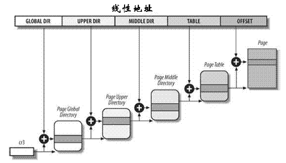

服务器体系与共享存储器架构
=======

| 日期 | 内核版本 | 架构| 作者 | GitHub| CSDN |
| ------- |:-------:|:-------:|:-------:|:-------:|:-------:|
| 2016-06-14 | [Linux-4.7](http://lxr.free-electrons.com/source/?v=4.7) | X86 & arm | [gatieme](http://blog.csdn.net/gatieme) | [LinuxDeviceDrivers](https://github.com/gatieme/LDD-LinuxDeviceDrivers) | [Linux内存管理](http://blog.csdn.net/gatieme/article/category/6225543) |

#1	分页机制
-------

在虚拟内存中，页表是个映射表的概念, 即从进程能理解的线性地址(linear address)映射到存储器上的物理地址(phisical address). 

很显然，这个页表是需要常驻内存的东西, 以应对频繁的查询映射需要(实际上，现代支持VM的处理器都有一个叫TLB的硬件级页表缓存部件，本文不讨论）。

##1.1	为什么使用多级页表来完成映射
-------

但是为什么要使用多级页表来完成映射呢?

用来将虚拟地址映射到物理地址的数据结构称为**页表**, 实现两个地址空间的关联最容易的方式是使用数组, 对虚拟地址空间中的每一页, 都分配一个数组项. 该数组指向与之关联的**页帧**, 但这会引发一个问题, 例如, IA-32体系结构使用4KB大小的页, 在虚拟地址空间为4GB的前提下, 则需要包含100万项的页表. 这个问题在64位体系结构下, 情况会更加糟糕. 而每个进程都需要自身的页表, 这回导致系统中大量的所有内存都用来保存页表.

设想一个典型的32位的X86系统，它的虚拟内存用户空间(user space)大小为3G, 并且典型的一个页表项(page table entry, pte)大小为4 bytes，每一个页(page)大小为4k bytes。那么这3G空间一共有(3G/4k=)786432个页面，每个页面需要一个pte来保存映射信息，这样一共需要786432个pte!

如何存储这些信息呢？一个直观的做法是用数组来存储，这样每个页能存储(4k/4=)1K个，这样一共需要(786432/1k=)768个连续的物理页面(phsical page)。而且，这只是一个进程，如果要存放所有N个进程，这个数目还要乘上N! 这是个巨大的数目，哪怕内存能提供这样数量的空间，要找到连续768个连续的物理页面在系统运行一段时间后碎片化的情况下，也是不现实的。

为减少页表的大小并容许忽略不需要的区域, 计算机体系结构的涉及会将虚拟地址分成多个部分. 同时虚拟地址空间的大部分们区域都没有使用, 因而页没有关联到页帧, 那么就可以使用功能相同但内存用量少的多的模型: **多级页表**

但是新的问题来了, 到底采用几级页表合适呢?

##1.2	32位系统中2级页表
-------

从80386开始, intel处理器的分页单元是4KB的页, 32位的地址空间被分为3部分

| 单元 | 描述 |
|:---:|:----:|
| 页目录表Directory | 最高10位 |
| 页中间表Table 	| 中间10位 |
| 页内偏移  		| 最低12位 |

即页表被划分为页目录表Directory和页中间表Tabl两个部分

此种情况下, 线性地址的转换分为两步完成.

*	第一步, 基于两级转换表(页目录表和页中间表), 最终查找到地址所在的页帧

*	第二步, 基于偏移, 在所在的页帧中查找到对应偏移的物理地址

使用这种二级页表可以有效的减少每个进程页表所需的RAM的数量. 如果使用简单的一级页表, 那将需要高达$2^20$个页表, 假设每项4B, 则共需要占用$2^20 * 4B = 4MB$的RAM来表示每个进程的页表. 当然我们并不需要映射所有的线性地址空间(32位机器上线性地址空间为4GB), 内核通常只为进程实际使用的那些虚拟内存区请求页表来减少内存使用量.

##1.3	64位系统中的分页
-------

正常来说, 对于32位的系统两级页表已经足够了, 但是对于64位系统的计算机, 这远远不够.

首先假设一个大小为4KB的标准页. 因为1KB覆盖$2^10$个地址的范围, 4KB覆盖$2^12$个地址, 所以offset字段需要12位.

这样线性地址空间就剩下64-12=52位分配给页中间表Table和页目录表Directory. 如果我们现在决定仅仅使用64位中的48位来寻址(这个限制其实已经足够了, 2^48=256TB, 即可达到256TB的寻址空间). 剩下的48-12=36位被分配给Table和Directory字段. 即使我们现在决定位两个字段各预留18位, 那么每个进程的页目录和页表都包含$2^18$个项, 即超过256000个项.

基于这个原因, 所有64位处理器的硬件分页系统都使用了额外的分页级别. 使用的级别取决于处理器的类型

| 平台名称 | 页大小 | 寻址所使用的位数 | 分页级别数 | 线性地址分级 |
|:-----:|:-----:|:-----:|:-----:|-------|
| alpha  | 8KB | 43 | 3 | 10 + 10 + 10 + 13  |
| ia64   | 4KB | 39 | 3 |  9 +  9 +  9 + 12  |
| ppc64  | 4KB | 41 | 3 | 10 + 10 +  9 + 12  |
| sh64   | 4KB | 41 | 3 | 10 + 10 +  9 + 12  |
| x86_64 | 4KB | 48 | 4 | 9 + 9 + 9 + 9 + 12 | 

##1.4	Linux中的分页
-------

层次话的页表用于支持对大地址空间快速, 高效的管理. 因此linux内核堆页表进行了分级.

前面我们提到过, 对于32位系统中, 两级页表已经足够了. 但是64位修奥更多数量的分页级别.

为了同时支持适用于32位和64位的系统, Linux采用了通用的分页模型. 在Linux-2.6.10版本中, Linux采用了三级分页模型. 而从2.6.11开始普遍采用了四级分页模型.

目前的内核的内存管理总是嘉定使用四级页表, 而不管底层处理器是否如此.

| 单元 | 描述 |
|:---:|:----:|
| 页全局目录 | Page GlobalDirectory  |
| 页上级目录	| Page Upper Directory  |
| 页中间目录	| Page Middle Directory |
| 页表	  | Page Table 			  |
| 页内偏移   | Page Offset		     |

Linux不同于其他的操作系统, 它把计算机分成独立层(体系结构无关)/依赖层(体系结构相关)两个层次. 对于页面的映射和管理也是如此. 页表管理分为两个部分, 第一个部分依赖于体系结构, 第二个部分是体系结构无关的. 所有数据结构几乎都定义在特定体系结构的文件中. 这些数据结构的定义可以在头文件`arch/对应体系/include/asm/page.h`
和`arch/对应体系/include/asm/pgtable.h`中找到. 但是对于AMD64和IA-32已经统一为一个体系结构. 但是在处理页表方面仍然有很多的区别, 因为相关的定义分为两个不同的文件`arch/x86/include/asm/page_32.h`
和`arch/x86/include/asm/page_64.h`
, 类似的也有`pgtable_xx.h` .

#2	页表
-------

Linux内核通过四级页表将虚拟内存空间分为5个部分(4个页表项用于选择页, 1个索引用来表示页内的偏移). 各个体系结构不仅地址长度不同, 而且地址字拆分的方式也不一定相同. 因此内核使用了宏用于将地址分解为各个分量.

其他内容请参照博主的另外两篇博客, 我就不罗嗦了

[深入理解计算机系统-之-内存寻址（五）--页式存储管理](http://blog.csdn.net/gatieme/article/details/50651561), 详细讲解了传统的页式存储管理机制

[深入理解计算机系统-之-内存寻址（六）--linux中的分页机制](http://blog.csdn.net/gatieme/article/details/50756050), 详细的讲解了Linux内核分页机制的实现机制

#3	Linux分页机制的演变
-------

##3.1	Linux的页表实现
-------

由于程序存在局部化特征, 这意味着在特定的时间内只有部分内存会被频繁访问，具体点，进程空间中的text段(即程序代码), 堆， 共享库，栈都是固定在进程空间的某个特定部分，这样导致进程空间其实是非常稀疏的, 于是，从硬件层面开始，页表的实现就是采用分级页表的方式，Linux内核当然也这么做。所谓分级简单说就是，把整个进程空间分成区块，区块下面可以再细分，这样在内存中只要常驻某个区块的页表即可，这样可以大量节省内存。

##3.2	Linux最初的二级页表
-------

Linux最初是在一台i386机器上开发的，这种机器是典型的32位X86架构，支持两级页表

一个32位虚拟地址如上图划分。当在进行地址转换时，

结合在CR3寄存器中存放的页目录(page directory, PGD)的这一页的物理地址，再加上从虚拟地址中抽出高10位叫做页目录表项(内核也称这为pgd)的部分作为偏移, 即定位到可以描述该地址的pgd;

从该pgd中可以获取可以描述该地址的页表的物理地址，再加上从虚拟地址中抽取中间10位作为偏移, 即定位到可以描述该地址的pte;

在这个pte中即可获取该地址对应的页的物理地址, 加上从虚拟地址中抽取的最后12位，即形成该页的页内偏移, 即可最终完成从虚拟地址到物理地址的转换。
从上述过程中，可以看出，对虚拟地址的分级解析过程，实际上就是不断深入页表层次，逐渐定位到最终地址的过程，所以这一过程被叫做page talbe walk。

至于这种做法为什么能节省内存，举个更简单的例子更容易明白。比如要记录16个球场的使用情况，每张纸能记录4个场地的情况。采用4+4+4+4，共4张纸即可记录，但问题是球场使用得很少，有时候一整张纸记录的4个球场都没人使用。于是，采用4 x 4方案，即把16个球场分为4组，同样每张纸刚好能记录4组情况。这样，使用一张纸A来记录4个分组球场情况，当某个球场在使用时，只要额外使用多一张纸B来记录该球场，同时，在A上记录"某球场由纸B在记录"即可。这样在大部分球场使用很少的情况下，只要很少的纸即困记录，当有球场被使用，有需要再用额外的纸来记录，当不用就擦除。这里一个很重要的前提就是:局部性。

##3.3	Linux的三级页表
-------

当X86引入物理地址扩展(Pisycal Addrress Extension, PAE)后，可以支持大于4G的物理内存(36位），但虚拟地址依然是32位，原先的页表项不适用，它实际多4 bytes被扩充到8 bytes，这意味着，每一页现在能存放的pte数目从1024变成512了(4k/8)。相应地，页表层级发生了变化，Linus新增加了一个层级，叫做页中间目录(page middle directory, PMD), 变成：

| 字段 | 描述 | 位数 |
|:---:|:---:|:---:|:---:|
| cr3 | 指向一个PDPT | crs寄存器存储                |
| PGD | 指向PDPT中4个项中的一个 | 位31~30    |
| PMD | 指向页目录中512项中的一个 | 位29~21  |
| PTE | 指向页表中512项中的一个 | 位20~12      |
| page offset  | 4KB页中的偏移 | 位11~0          |

实际的page table walk依然类似，只不过多了一级。

现在就同时存在2级页表和3级页表，在代码管理上肯定不方便。巧妙的是，Linux采取了一种抽象方法：所有架构全部使用3级页表: 即PGD -> PMD -> PTE。那只使用2级页表(如非PAE的X86)怎么办？

办法是针对使用2级页表的架构，把PMD抽象掉，即虚设一个PMD表项。这样在page table walk过程中，PGD本直接指向PTE的，现在不了，指向一个虚拟的PMD，然后再由PMD指向PTE。这种抽象保持了代码结构的统一。

##3.4	Linux的四级页表
-------

硬件在发展，3级页表很快又捉襟见肘了，原因是64位CPU出现了, 比如X86_64， 它的硬件是实实在在支持4级页表的。它支持48位的虚拟地址空间[1](不过Linux内核最开始只使用47位)。如下：

| 字段 | 描述 | 位数 |
|:---:|:---:|:---:|:---:|
| PML4| 指向一个PDPT | 位47~39 |
| PGD | 指向PDPT中4个项中的一个 | 位38~30 |
| PMD | 指向页目录中512项中的一个 | 位29~21 |
| PTE | 指向页表中512项中的一个 | 位20~12 |
| page offset  | 4KB页中的偏移 | 位11~0

Linux内核针为使用原来的3级列表(PGD->PMD->PTE)，做了折衷。即采用一个唯一的，共享的顶级层次，叫PML4[2]。这个PML4没有编码在地址中，这样就能套用原来的3级列表方案了。不过代价就是，由于只有唯一的PML4, 寻址空间被局限在(239=)512G, 而本来PML4段有9位, 可以支持512个PML4表项的。现在为了使用3级列表方案，只能限制使用一个， 512G的空间很快就又不够用了，解决方案呼之欲出。

在2004年10月，当时的X86_64架构代码的维护者Andi Kleen提交了一个叫做4level page tables for Linux的PATCH系列，为Linux内核带来了4级页表的支持。在他的解决方案中，不出意料地，按照X86_64规范，新增了一个PML4的层级, 在这种解决方案中，X86_64拥一个有512条目的PML4, 512条目的PGD, 512条目的PMD, 512条目的PTE。对于仍使用3级目录的架构来说，它们依然拥有一个虚拟的PML4,相关的代码会在编译时被优化掉。 这样，就把Linux内核的3级列表扩充为4级列表。这系列PATCH工作得不错，不久被纳入Andrew Morton的-mm树接受测试。

不出意外的话，它将在v2.6.11版本中释出。但是，另一个知名开发者Nick Piggin提出了一些看法，他认为Andi的Patch很不错，不过他认为最好还是把PGD作为第一级目录，把新增加的层次放在中间，并给出了他自己的Patch:alternate 4-level page tables patches。Andi更想保持自己的PATCH, 他认为Nick不过是玩了改名的游戏，而且他的PATCH经过测试很稳定，快被合并到主线了，不宜再折腾。

不过Linus却表达了对Nick Piggin的支持，理由是Nick的做法conceptually least intrusive。毕竟作为Linux的扛把子，稳定对于Linus来说意义重大。

最终，不意外地，最后Nick Piggin的PATCH在v2.6.11版本中被合并入主线。在这种方案中，4级页表分别是：PGD -> PUD -> PMD -> PTE。

#4	链接
-------

[我对linux内核四级分页理解](http://bbs.csdn.net/topics/390831818)

[Linux内核4级页表的演进](http://blog.csdn.net/hmsiwtv/article/details/39956981)

[Linux内存 之 页表](http://biancheng.dnbcw.info/linux/335152.html)

[内存管理（四） 页表数据结构 ](http://blog.chinaunix.net/uid-21718047-id-3140041.html)

[Linux内存管理之我见(二)-页表、页式内存管理机制](http://www.360doc.com/content/11/0804/10/7204565_137844381.shtml)

