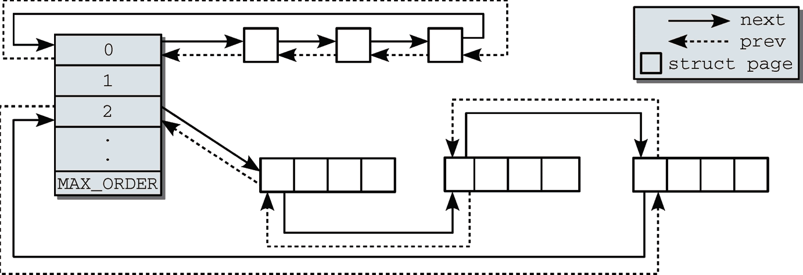

服务器体系与共享存储器架构
=======

| 日期 | 内核版本 | 架构| 作者 | GitHub| CSDN |
| ------- |:-------:|:-------:|:-------:|:-------:|:-------:|
| 2016-06-14 | [Linux-4.7](http://lxr.free-electrons.com/source/?v=4.7) | X86 & arm | [gatieme](http://blog.csdn.net/gatieme) | [LinuxDeviceDrivers](https://github.com/gatieme/LDD-LinuxDeviceDrivers) | [Linux内存管理](http://blog.csdn.net/gatieme/article/category/6225543) |


在内核初始化完成之后, 内存管理的责任就由伙伴系统来承担. 伙伴系统基于一种相对简单然而令人吃惊的强大算法.

Linux内核使用二进制伙伴算法来管理和分配物理内存页面, 该算法由Knowlton设计, 后来Knuth又进行了更深刻的描述.

伙伴系统是一个结合了2的方幂个分配器和空闲缓冲区合并计技术的内存分配方案, 其基本思想很简单. 内存被分成含有很多页面的大块, 每一块都是2个页面大小的方幂. 如果找不到想要的块, 一个大块会被分成两部分, 这两部分彼此就成为伙伴. 其中一半被用来分配, 而另一半则空闲. 这些块在以后分配的过程中会继续被二分直至产生一个所需大小的块. 当一个块被最终释放时, 其伙伴将被检测出来, 如果伙伴也空闲则合并两者.

*	内核如何记住哪些内存块是空闲的
*	分配空闲页面的方法
*	影响分配器行为的众多标识位
*	内存碎片的问题和分配器如何处理碎片


#2	伙伴系统的结构
-------


系统内存中的每个物理内存页（页帧），都对应于一个struct page实例, 每个内存域都关联了一个struct zone的实例，其中保存了用于管理伙伴数据的主要数数组


```cpp
//  http://lxr.free-electrons.com/source/include/linux/mmzone.h?v=4.7#L324
struct zone
{
	 /* free areas of different sizes */
	struct free_area        free_area[MAX_ORDER];
};
```

struct free_area是一个伙伴系统的辅助数据结构, 它定义在[include/linux/mmzone.h?v=4.7, line 88](http://lxr.free-electrons.com/source/include/linux/mmzone.h?v=4.7#L88)

```cpp
struct free_area {
	struct list_head        free_list[MIGRATE_TYPES];
unsigned long           nr_free;
};
```

| 字段 | 描述 |
|:-----:|:-----:|
| free_list | 是用于连接空闲页的链表. 页链表包含大小相同的连续内存区 |
| nr_free | 指定了当前内存区中空闲页块的数目（对0阶内存区逐页计算，对1阶内存区计算页对的数目，对2阶内存区计算4页集合的数目，依次类推 |


伙伴系统的分配器维护空闲页面所组成的块, 这里每一块都是2的方幂个页面, 方幂的指数称为**阶**.


阶是伙伴系统中一个非常重要的术语. 它描述了内存分配的数量单位. 内存块的长度是$2^order$, 其中order的范围从0到MAX_ORDER


zone->free_area[MAX_ORDER]数组中阶作为各个元素的索引, 用于指定对应链表中的连续内存区包含多少个页帧.

*	数组中第0个元素的阶为0, 它的free_list链表域指向具有包含区为单页($2^0=1$)的内存页面链表

*	数组中第1个元素的free_list域管理的内存区为两页($2^1=2$)

*	第3个管理的内存区为4页, 依次类推.

*	直到$2^{MAX_ORDER-1}$个页面大小的块


##MAX_ORDER与FORCE_MAX_ZONEORDER配置选项
-------

一般来说`MAX_ORDER`默认定义为11, 这意味着一次分配可以请求的页数最大是2^11=2048, 参见[include/linux/mmzone.h?v=4.7, line 22](http://lxr.free-electrons.com/source/include/linux/mmzone.h?v=4.7#L22)

```cpp
/* Free memory management - zoned buddy allocator.  */
#ifndef CONFIG_FORCE_MAX_ZONEORDER
#define MAX_ORDER 11
#else
#define MAX_ORDER CONFIG_FORCE_MAX_ZONEORDER
#endif
#define MAX_ORDER_NR_PAGES (1 << (MAX_ORDER - 1))
```


但如果特定于体系结构的代码设置了`FORCE_MAX_ZONEORDER`配置选项, 该值也可以手工改变

例如，IA-64系统上巨大的地址空间可以处理`MAX_ORDER = 18`的情形，而ARM或v850系统则使用更小的值(如8或9). 但这不一定是由计算机支持的内存数量比较小引起的，也可能是内存对齐方式的要求所导致


可以参考一些架构的Kconfig文件如下

| arm | arm64 |
|:----:|:-----:|:-------:|
| [arch/arm/Kconfig?v=4.7, line 1696](http://lxr.free-electrons.com/source/arch/arm/Kconfig?v=4.7#L1696) | [arch/arm64/Kconfig?v=4.7, line 679](http://lxr.free-electrons.com/source/arch/arm64/Kconfig?v=4.7#L679)


比如[arm64体系结构的Kconfig配置文件的描述](http://lxr.free-electrons.com/source/arch/arm64/Kconfig?v=4.7#L679) |

```cpp
config FORCE_MAX_ZONEORDER
int
default "14" if (ARM64_64K_PAGES && TRANSPARENT_HUGEPAGE)
default "12" if (ARM64_16K_PAGES && TRANSPARENT_HUGEPAGE)
default "11"`
```


##内存区是如何连接的
-------

内存区中第1页内的链表元素, 可用于将内存区维持在链表中。因此，也不必引入新的数据结构来管理物理上连续的页，否则这些页不可能在同一内存区中. 如下图所示





伙伴不必是彼此连接的. 如果一个内存区在分配其间分解为两半, 内核会自动将未用的一半加入到对应的链表中.

如果在未来的某个时刻, 由于内存释放的缘故, 两个内存区都处于空闲状态, 可通过其地址判断其是否为伙伴. 管理工作较少, 是伙伴系统的一个主要优点.

基于伙伴系统的内存管理专注于某个结点的某个内存域, 例如, DMA或高端内存域. 但所有内存域和结点的伙伴系统都通过备用分配列表连接起来.

下图说明了这种关系.


最后要注意, 有关伙伴系统和当前状态的信息可以在/proc/buddyinfo中获取


上述输出给出了各个内存域中每个分配阶中空闲项的数目, 从左至右, 阶依次升高. 上面给出的信息取自4 GiB物理内存的AMD64系统.


#3	避免碎片
-------


