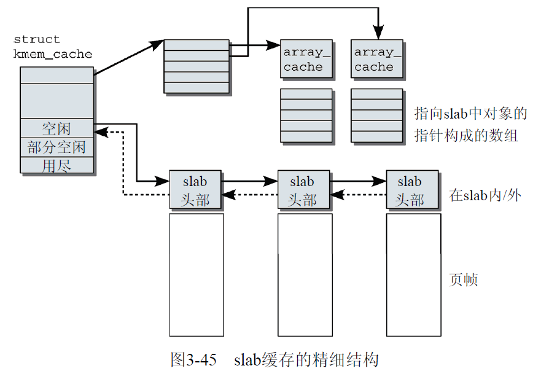
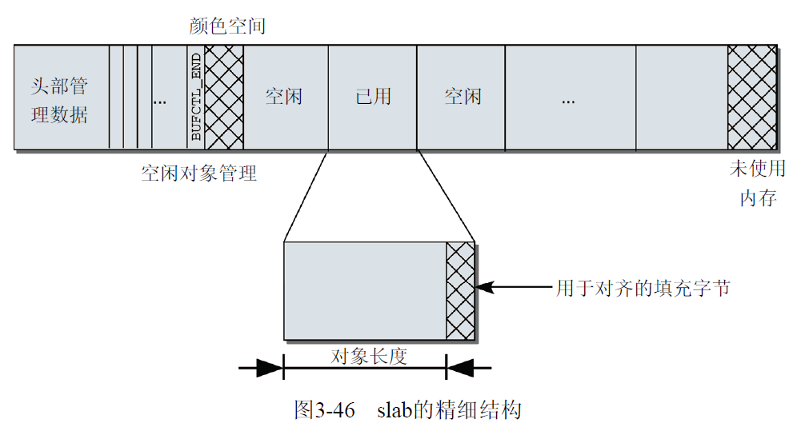

slab分配器
=======

| 日期 | 内核版本 | 架构| 作者 | GitHub| CSDN |
| ------- |:-------:|:-------:|:-------:|:-------:|:-------:|
| 2016-06-14 | [Linux-4.7](http://lxr.free-electrons.com/source/?v=4.7) | X86 & arm | [gatieme](http://blog.csdn.net/gatieme) | [LinuxDeviceDrivers](https://github.com/gatieme/LDD-LinuxDeviceDrivers) | [Linux内存管理](http://blog.csdn.net/gatieme/article/category/6225543) |


#2	slab分配器
-------

##2.1	slab分配器
-------

每个C程序员都熟悉malloc, 及其在C标准库中的相关函数. 大多数程序分配若干字节内存时. 经常会调用这些函数.

内核也必须经常分配内存, 但无法借助于标准库的函数. 上面描述的伙伴系统支持按页分配内存, 但这个单位太大了. 如果需要为一个10个字符的字符串分配空间, 分配一个4 KiB或更多空间的完整页面, 不仅浪费而且完全不可接受.
显然的解决方案是将页拆分为更小的单位, 可以容纳大量的小对象.

为此必须引入新的管理机制, 这会给内核带来更大的开销. 为最小化这个额外负担对系统性能的影响, 该管理层的实现应该尽可能紧凑, 以便不要对处理器的高速缓存和TLB带来显著影响. 同时, 内核还必须保证内存利用的速度和效率. 不仅Linux, 而且类似的UNIX和所有其他的操作系统, 都需要面对这个问题. 经过一定的时间, 已经提出了一些或好或坏的解决方案, 在一般的操作系统文献中都有讲解

此类提议之一, 所谓slab分配, 证明对许多种类工作负荷都非常高效. 它是由Sun公司的一个雇员`Jeff Bonwick`，在`Solaris 2.4`中设计并实现的. 由于他公开了其方法, 因此也可以为Linux实现一个版本.

提供小内存块不是slab分配器的唯一任务. 由于结构上的特点. 它也用作一个缓存. 主要针对经常分配并释放的对象. 通过建立slab缓存, 内核能够储备一些对象, 供后续使用, 即使在初始化状态, 也是如此.

举例来说, 为管理与进程关联的文件系统数据, 内核必须经常生成`struct fs_struct`的新实例. 此类型实例占据的内存块同样需要经常回收(在进程结束时). 换句话说, 内核趋向于非常有规律地分配并释放大小为`sizeof{fs_struct}`的内存块. slab分配器将释放的内存块保存在一个内部列表中. 并不马上返回给伙伴系统. 在请求为该类对象分配一个新实例时, 会使用最近释放的内存块. 这有两个优点. 首先, 由于内核不必使用伙伴系统算法, 处理时间会变短. 其次, 由于该内存块仍然是"新"的，因此其仍然驻留在CPU高速缓存的概率较高.


slab分配器还有两个更进一步的好处

*	调用伙伴系统的操作对系统的数据和指令高速缓存有相当的影响。内核越浪费这些资源, 这些资源对用户空间进程就越不可用. 更轻量级的slab分配器在可能的情况下减少了对伙伴系统的调用, 有助于防止不受欢迎的缓存"污染".

*	如果数据存储在伙伴系统直接提供的页中，那么其地址总是出现在2的幂次的整数倍附近(许多将页划分为更小块的其他分配方法, 也有同样的特征). 这对CPU高速缓存的利用有负面影响, 由于这种地址分布, 使得某些缓存行过度使用, 而其他的则几乎为空. 多处理器系统可能会加剧这种不利情况, 因为不同的内存地址可能在不同的总线上传输, 上述情况会导致某些总线拥塞, 而其他总线则几乎没有使用.

通过slab着色(slab coloring), slab分配器能够均匀地分布对象, 以实现均匀的缓存利用


经常使用的内核对象保存在CPU高速缓存中，这是我们想要的效果。前文的注释提到, 从`slab`分配器的角度进行衡量, 伙伴系统的高速缓存和TLB占用较大, 这是一个负面效应.

因为这会导致不重要的数据驻留在`CPU`高速缓存中, 而重要的数据则被置换到内存, 显然应该防止这种情况出现.

>着色这个术语是隐喻性的. 它与颜色无关, 只是表示slab中的对象需要移动的特定偏移量, 以便使对象放置到不同的缓存行.

`slab`分配器由何得名?各个缓存管理的对象，会合并为较大的组，覆盖一个或多个连续页帧. 这种组称作slab，每个缓存由几个这种slab组成.


#2.2	备选slab分配器
-------


尽管slab分配器对许多可能的工作负荷都工作良好, 但也有一些情形, 它无法提供最优性能. 如果某些计算机处于当前硬件尺度的边界上, 在此类计算机上使用slab分配会出现一些问题 : 微小的嵌入式系统, 配备有大量物理内存的大规模并行系统. 在第二种情况下, slab分配器所需的大量元数据可能成为一个问题 : 开发者称在大型系统上仅slab的数据结构就需要很多吉字节内存. 对嵌入式系统来说, slab分配器代码量和复杂性都太高.

为处理此类情形, 在内核版本2.6开发期间, 增加了slab分配器的两个替代品.

*	`slob`分配器进行了特别优化, 以便减少代码量. 它围绕一个简单的内存块链表展开(因此而得名). 在分配内存时, 使用了同样简单的最先适配算法.`slob`分配器只有大约600行代码, 总的代码量很小. 事实上, 从速度来说, 它不是最高效的分配器, 也肯定不是为大型系统设计的.

*	`slub`分配器通过将页帧打包为组，并通过`struct page`中未使用的字段来管理这些组，试图最小化所需的内存开销。读者此前已经看到，这样做不会简化该结构的定义，但在大型计算机上`slub`比`slab`提供了更好的性能，说明了这样做是正确的.

由于`slab`分配是大多数内核配置的默认选项，我不会详细讨论备选的分配器. 但有很重要的一点需要强调, 内核的其余部分无需关注底层选择使用了哪个分配器. 所有分配器的前端接口都是相同的.

每个分配器都必须实现一组特定的函数, 用于内存分配和缓存


*	`kmalloc`、`__kmalloc`和`kmalloc_node`是一般的(特定于结点)内存分配函数.

*	`kmem_cache_alloc`、`kmem_cache_alloc_node`提供（特定于结点）特定类型的内核缓存.

下文在讨论`slab`分配器时，会讲解这些函数的行为. 使用这些标准函数, 内核可以提供更方便的函数, 而不涉及内存在内部具体如何管理. 举例来说, kcalloc为数组分配内存，而kzalloc分配一个填充字节0的内存区.

普通内核代码只需要包含slab.h，即可使用内存分配的所有标准内核函数。连编系统会保证使用编译时选择的分配器，来满足程序的内存分配请求


##2.3	内核中的内存管理
-------

内核中一般的内存分配和释放函数与C标准库中等价函数的名称类似，用法也几乎相同.

*	`kmalloc(size, flags)`分配长度为`size`字节的一个内存区, 并返回指向该内存区起始处的一个`void`指针. 如果没有足够内存(在内核中这种情形不大可能, 但却始终要考虑到), 则结果为`NULL`指针. `flags`参数使用之前讨论的GFP_常数，来指定分配内存的具体内存域，例如GFP_DMA指定分配适合于DMA的内存区.

*	`kfree(*ptr)`释放`*ptr`指向的内存区.


与用户空间程序设计相比, 内核还包括`percpu_alloc`和`percpu_free`函数，用于为各个系统CPU分配和释放所需内存区(不是明确地用于当前活动CPU).

`kmalloc`在内核源代码中的使用数以千计, 但模式都是相同的. 用`kmalloc`分配的内存区, 首先通过类型转换变为正确的类型, 然后赋值到指针变量.

>info = (struct cdrom_info *) kmalloc (sizeof (struct cdrom_info), GFP_KERNEL);

从程序员的角度来看，建立和使用缓存的任务不是特别困难. 必须首先用`kmem_cache_create`建立一个适当的缓存, 接下来即可使用`kmem_cache_alloc`和`kmem_cache_free`分配和释放其中包含的对象。slab分配器负责完成与伙伴系统的交互，来分配所需的页.

所有活动缓存的列表保存在`/proc/slabinfo`中(为节省空间，下文的输出省去了不重要的部分).


输出的各列除了包含用于标识各个缓存的字符串名称(也确保不会创建相同的缓存)之外, 还包含下列信息.


*	缓存中活动对象的数量。

*	缓存中对象的总数（已用和未用）。

*	所管理对象的长度，按字节计算。

*	一个slab中对象的数量。

*	每个slab中页的数量。

*	活动slab的数量。

*	在内核决定向缓存分配更多内存时, 所分配对象的数量. 每次会分配一个较大的内存块, 以减少与伙伴系统的交互. 在缩小缓存时，也使用该值作为释放内存块的大小.


除了容易识别的缓存名称如`unix_sock`(用于UNIX域套接字, 即`struct unix_sock`类型的对象), 还有其他字段名称`kmalloc-size`. 提供DMA内存域的计算机还包括用于DMA分配的缓存, 在上述的例子中没有. 这些是kmalloc函数的基础，是内核为不同内存长度提供的slab缓存，除极少例外，其长度都是2的幂次，长度的范围从`2^5=32`B（用于页大小为4 KiB的计算机）或64B（所有其他计算机）,到225B. 上界也可以更小，是由`KMALLOC_MAX_SIZE`设置, 后者根据系统页大小和最大允许的分配阶计算:

```cpp
<slab.h>
#define KMALLOC_SHIFT_HIGH ((MAX_ORDER + PAGE_SHIFT -1) <= 25 ? \
(MAX_ORDER + PAGE_SHIFT -1) : 25)
#define KMALLOC_MAX_SIZE (1UL << KMALLOC_SHIFT_HIGH)
#define KMALLOC_MAX_ORDER (KMALLOC_SHIFT_HIGH -PAGE_SHIFT)
```

每次调用`kmalloc`时, 内核找到最适合的缓存, 并从中分配一个对象满足请求(如果没有刚好适合的缓存，则分配稍大的对象，但不会分配更小的对象).

在实际实现中，上文中的`slab`分配器和缓存之间的差异迅速消失，以至于本书后文中将这两个名词用作同义词。在讨论slab分配器的实现之后


#3	slab分配的原理
-------

`slab`分配器由一个紧密地交织的数据和内存结构的网络组成, 初看起来不容易理解其运作方式.

因此在考察其实现之前, 重要的是获得各个结构之间关系的概观。
基本上, slab缓存由图3-44所示的两部分组成：保存管理性数据的缓存对象和保存被管理对象的各个slab.


每个缓存只负责一种对象类型（例如struct unix_sock实例），或提供一般性的缓冲区。各个缓存中slab的数目各有不同，这与已经使用的页的数目、对象长度和被管理对象的数目有关。3.6.4节将更详细地描述缓存长度的计算方式。
另外，系统中所有的缓存都保存在一个双链表中。这使得内核有机会依次遍历所有的缓存。这是有必要的，例如在即将发生内存不足时，内核可能需要缩减分配给缓存的内存数量.


##3.1	缓存的精细结构
-------


如果我们更仔细地研究缓存的结构，就可以注意到一些更重要的细节。图3-45给出了缓存各组成部分的概述.
除了管理性数据（如已用和空闲对象或标志寄存器的数目），缓存结构包括两个特别重要的成员.

*	指向一个数组的指针, 其中保存了各个CPU最后释放的对象.

*	每个内存结点都对应3个表头，用于组织slab的链表
	第1个链表包含完全用尽的slab，第2个是部分空闲的slab，第3个是空闲的slab





缓存结构指向一个数组, 其中包含了与系统CPU数目相同的数组项. 每个元素都是一个指针，指向一个进一步的结构称之为数组缓存(array cache), 其中包含了对应于特定系统CPU的管理数据(就总体来看，不是用于缓存). 管理性数据之后的内存区包含了一个指针数组，各个数组项指向slab中未使用的对象.


为最好地利用CPU高速缓存, 这些per-CPU指针是很重要的。在分配和释放对象时，采用后进先出原理(LIFO，last in first out). 内核假定刚释放的对象仍然处于CPU高速缓存中，会尽快再次分配它(响应下一个分配请求). 仅当per-CPU缓存为空时，才会用slab中的空闲对象重新填充它们.


这样，对象分配的体系就形成了一个三级的层次结构，分配成本和操作对CPU高速缓存和TLB的负面影响逐级升高.

1.	仍然处于CPU高速缓存中的per-CPU对象

2.	现存slab中未使用的对象

3.	刚使用伙伴系统分配的新slab中未使用的对象




##3.2	slab的精细结构
-------


对象在slab中并非连续排列，而是按照一个相当复杂的方案分布。图3-46说明了相关细节.


用于每个对象的长度并不反映其确切的大小. 相反, 长度已经进行了舍入，以满足某些对齐方式的要求. 有两种可用的备选对齐方案.


*	slab创建时使用标志SLAB_HWCACHE_ALIGN，slab用户可以要求对象按硬件缓存行对齐. 那么会按照cache_line_size的返回值进行对齐，该函数返回特定于处理器的L1缓存大小。
如果对象小于缓存行长度的一半，那么将多个对象放入一个缓存行。


*	如果不要求按硬件缓存行对齐，那么内核保证对象按BYTES_PER_WORD对齐，该值是表示`void`指针所需字节的数目.


在32位处理器上，`void`指针需要4个字节。因此，对有6个字节的对象，则需要8 = 2×4个字节, 15个字节的对象需要16=4×4个字节。多余的字节称为填充字节.


填充字节可以加速对slab中对象的访问。如果使用对齐的地址, 那么在几乎所有的体系结构上, 内存访问都会更快. 这弥补了使用填充字节必然导致需要更多内存的不利情况.


管理结构位于每个slab的起始处，保存了所有的管理数据（和用于连接缓存链表的链表元素).


其后面是一个数组，每个（整数）数组项对应于slab中的一个对象。只有在对象没有分配时，相应的数组项才有意义。在这种情况下，它指定了下一个空闲对象的索引。由于最低编号的空闲对象的编号还保存在slab起始处的管理结构中，内核无需使用链表或其他复杂的关联机制，即可轻松找到当前可用的所有对象。 数组的最后一项总是一个结束标记，值为BUFCTL_END.


大多数情况下, slab内存区的长度(减去了头部管理数据)是不能被（可能填补过的）对象长度整除的。因此，内核就有了一些多余的内存，可以用来以偏移量的形式给slab"着色", 如上文所述.


缓存的各个slab成员会指定不同的偏移量，以便将数据定位到不同的缓存行，因而slab开始和结束处的空闲内存是不同的。在计算偏移量时，内核必须考虑其他的对齐因素. 


例如，L1高速缓存中数据的对齐(下文讨论).


管理数据可以放置在slab自身，也可以放置到使用kmalloc分配的不同内存区中. 内核如何选择, 取决于slab的长度和已用对象的数量。相应的选择标准稍后讨论。管理数据和slab内存之间的关联很容易建立，因为slab头包含了一个指针，指向slab数据区的起始处(无论管理数据是否在slab上).


最后，内核需要一种方法, 通过对象自身即可识别slab(以及对象驻留的缓存). 根据对象的物理内存地址, 可以找到相关的页, 因此可以在全局mem_map数组中找到对应的page实例.


我们已经知道，page结构包括一个链表元素，用于管理各种链表中的页。对于slab缓存中的页而言, 该指针是不必要的，可用于其他用途.


*	page->lru.next指向页驻留的缓存的管理结构


*	page->lru.prev指向保存该页的slab的管理结构


设置或读取slab信息分别由`set_page_slab`和`get_page_slab`函数完成，带有`_cache`后缀的函数则处理缓存信息的设置和读取.


```cpp
mm/slab.c
void page_set_cache(struct page *page, struct kmem_cache *cache)
struct kmem_cache *page_get_cache(struct page *page)
void page_set_slab(struct page *page, struct slab *slab)
struct slab *page_get_slab(struct page *page)
```


此外，内核还对分配给`slab`分配器的每个物理内存页都设置标志`PG_SLAB`.


#4	实现
-------

为实现如上所述的`slab`分配器, 使用了各种数据结构. 尽管看上去并不困难，相关的代码并不总是容易阅读或理解. 这是因为许多内存区需要使用指针运算和类型转换进行操作, 这些可不是C语言中以清晰简明著称的领域。由于slab系统带有大量调试选项，所以代码中遍布着预处理器语句.

其中一些如下列出.

*	危险区(Red Zoning)
	在每个对象的开始和结束处增加一个额外的内存区，其中填充已知的字节模式. 如果模式被修改, 程序员在分析内核内存时注意到，可能某些代码访问了不属于它们的内存区.

*	对象毒化(Object Poisoning)
	在建立和释放slab时，将对象用预定义的模式填充. 如果在对象分配时注意到该模式已经改变，程序员就知道已经发生了未授权访问.

为简明起见，我们把注意力集中在整体而不是细节上。我们在下文不使用上述选项，只讲解一个"纯粹"的slab分配器.


##4.1	数据结构
-------


每个缓存由`kmem_cache`结构的一个实例表示, 将slab缓存视为通过一组标准函数来高效地创建和释放特定类型对象的机制

该结构定义在[mm/slab.h?v=4.7, line 19](http://lxr.free-electrons.com/source/mm/slab.h?v=4.7#L19), 内容如下


| kmem_cache | slab | slob | slub |
|:--------------:|:-----:|:-----:|:-----:|
| [dent?i=kmem_cache](http://lxr.free-electrons.com/ident?v=4.7;i=kmem_cache) | [include/linux/slab_def.h?v=4.7, line 10](http://lxr.free-electrons.com/source/include/linux/slab_def.h?v=4.7#L10) | [mm/slab.h?v=4.7, line 19](http://lxr.free-electrons.com/source/mm/slab.h?v=4.7#L19) | [include/linux/slub_def.h?v=4.7, line 62](http://lxr.free-electrons.com/source/include/linux/slub_def.h?v=4.7#L62) |


```cpp
/*
 * Definitions unique to the original Linux SLAB allocator.
 */

struct kmem_cache {
    //  per-CPU数据，在每次分配/释放期间都会访问
    struct array_cache __percpu *cpu_cache;

/* 1) Cache tunables. Protected by slab_mutex
 *    可调整的缓存参数。由cache_chain_mutex保护  */
    //  要转移本地高速缓存的大批对象的数量
    unsigned int batchcount;
    unsigned int limit;
    //  本地高速缓存中空闲对象的最大数目
    unsigned int shared;
    //  高速缓存的大小
    unsigned int size;
    struct reciprocal_value reciprocal_buffer_size;

/* 2) touched by every alloc & free from the backend
 *    后端每次分配和释放内存时都会访问 */
    //  描述高速缓存永久属性的一组标志
    unsigned int flags;         /* constant flags */
    //  封装在一个单独slab中的对象个数
    unsigned int num;           /* # of objs per slab */

/* 3) cache_grow/shrink
 *    缓存的增长/缩减  */
    /* order of pgs per slab (2^n) 一个单独slab中包含的连续页框数目的对数*/
    unsigned int gfporder;

    /* force GFP flags, e.g. GFP_DMA   强制的GFP标志，例如GFP_DMA  */
    gfp_t allocflags;

    size_t colour;          /* cache colouring range 缓存着色范围  */
    unsigned int colour_off;    /* colour offset slab中的着色偏移 */
    struct kmem_cache *freelist_cache;
    unsigned int freelist_size;

    /* constructor func 构造函数  */
    void (*ctor)(void *obj);

/* 4) cache creation/removal
 *    缓存创建/删除 */
    const char *name;   //  存放高速缓存名字的字符数组
    struct list_head list;  //  高速缓存描述符双向链表使用的指针
    int refcount;
    int object_size;
    int align;

/* 5) statistics
 *    统计量 */
#ifdef CONFIG_DEBUG_SLAB
    unsigned long num_active;
    unsigned long num_allocations;
    unsigned long high_mark;
    unsigned long grown;
    unsigned long reaped;
    unsigned long errors;
    unsigned long max_freeable;
    unsigned long node_allocs;
    unsigned long node_frees;
    unsigned long node_overflow;
    atomic_t allochit;
    atomic_t allocmiss;
    atomic_t freehit;
    atomic_t freemiss;
#ifdef CONFIG_DEBUG_SLAB_LEAK
    atomic_t store_user_clean;
#endif

    /*
     * If debugging is enabled, then the allocator can add additional
     * fields and/or padding to every object. size contains the total
     * object size including these internal fields, the following two
     * variables contain the offset to the user object and its size.
     */
    int obj_offset;
#endif /* CONFIG_DEBUG_SLAB */

#ifdef CONFIG_MEMCG
    struct memcg_cache_params memcg_params;
#endif
#ifdef CONFIG_KASAN
    struct kasan_cache kasan_info;
#endif

#ifdef CONFIG_SLAB_FREELIST_RANDOM
    void *random_seq;
#endif

    struct kmem_cache_node *node[MAX_NUMNODES];
};
```

`kmem_cache`是`Linux`内核提供的快速内存缓冲接口, 这些内存块要求是大小相同的, 因为分配出的内存在接口释放时并不真正释放, 而是作为缓存保留, 下一次请求分配时就可以直接使用, 省去了各种内存块初始化或释放的操作, 因此分配速度很快, 通常用于大数量的内存块分配的情况, 如`inode`节点, `skbuff`头, `netfilter`的连接等, 其实`kmalloc`也是从`kmem_cache`中分配的，可通过`/proc/slabinfo`文件直接读取`cache`分配情况.


| 字段 | 说明 |
|:-----:|:-----:|
| cpu_cache | 是一个指向数组的指针，每个数组项都对应于系统中的一个CPU，每个数组项都包含了另一个指针，指向下文讨论的array_cache结构的实例 |
| batchcount | 指定了在per-CPU列表为空的情况下，从缓存的slab中获取对象的数目，它还表示在缓存增长时分配的对象数目 |
| limit | 指定了per-CPU列表中保存的对象的最大数目。如果超出了这个值，内核会将batchcount个对象返回到slab |
| size | 指定了缓存中管理的对象的长度1 |
| gfporder | 指定了slab包含的页数目以2为底的对数，简而言之，slab包含2^gfporder页 |
| colorur | 指定了颜色的最大数目 |
| colour_off | 基本偏移量乘以颜色值获得的绝对偏移量 |
| dflags | 另一标志集合，描述slab的动态性质 |
| ctor | 一个指针，指向在对象创建时调用的构造函数 |
| name | 一个字符串，表示缓存的名称 |
| list | 是一个标准链表元素 |


这个冗长的结构分为多个部分，如源代码中的注释所示.


###4.1.1	per-cpu数据(第0~1部分)
-------


开始的几个成员涉及每次分配期间内核对特定于CPU数据的访问，在本节稍后讨论。

*	cpu_cache是一个指向数组的指针，每个数组项都对应于系统中的一个CPU。每个数组项都包含了另一个指针，指向下文讨论的array_cache结构的实例。

*	batchcount指定了在per-CPU列表为空的情况下，从缓存的slab中获取对象的数目。它还表示在缓存增长时分配的对象数目。

*	limit指定了per-CPU列表中保存的对象的最大数目。如果超出该值，内核会将batchcount个对象返回到slab（如果接下来内核缩减缓存，则释放的内存从slab返回到伙伴系统）


内核对每个系统处理器都提供了一个`array_cache`实例. 该结构定义如下

```cpp
struct array_cache {
    unsigned int avail;
    unsigned int limit;
    unsigned int batchcount;
    unsigned int touched;
    void *entry[];  /*
             * Must have this definition in here for the proper
             * alignment of array_cache. Also simplifies accessing
             * the entries.
             */
};
```


*	`batchcount`和`limit`的语义已经在上文给出, `kmem_cache_s`的值用作（通常不修改）`per-CPU`值的默认值，用于缓存的重新填充或清空.

*	`avail`保存了当前可用对象的数目.

*	在从缓存移除一个对象时，将`touched`设置为1，而缓存收缩时, 则将`touched`设置为0。这使得内核能够确认在缓存上一次收缩之后是否被访问过，也是缓存重要性的一个标志。

*	最后一个成员`entry`是一个伪数组, 其中并没有数组项, 只是为了便于访问内存中`array_cache`实例之后缓存中的各个对象而已.


###4.1.2	基本数据变量
-------


*	kmem_cache的第2、第3部分包含了管理slab所需的全部变量，在填充或清空per-CPU缓存时需要访问这两部分.

*	node[MAX_NUMNODES];是一个数组，每个数组项对应于系统中一个可能的内存结点. 每个数组项都包含kmem_cache_node的一个实例, 该结构中有3个slab列表（完全用尽、空闲、部分空闲）

该成员必须置于结构的末尾, 尽管它在形式上总是有MAX_NUMNODES项, 但在NUMA计算机上实际可用的结点数目可能会少一些。因而该数组需要的项数也会变少，内核在运行时对该结构分配比理论上更少的内存，就可以缩减该数组的项数。如果nodelists放置在该结构中间，就无法做到这一点.

在UMA计算机上，这称不上问题，因为只有一个可用结点.

*	flags是一个标志寄存器，定义缓存的全局性质。当前只有一个标志位。如果管理结构存储在slab外部，则置位CFLGS_OFF_SLAB

*	`num`保存了可以放入slab的对象的最大数目

kmem_cache_node定义在[mm/slab.h?v=4.7, line 417](http://lxr.free-electrons.com/source/mm/slab.h?v=4.7#L417)


```cpp
/*
 * The slab lists for all objects.
 */
struct kmem_cache_node {
    spinlock_t list_lock;

#ifdef CONFIG_SLAB
    struct list_head slabs_partial; /* partial list first, better asm code */
    struct list_head slabs_full;
    struct list_head slabs_free;
    unsigned long free_objects;
    unsigned int free_limit;
    unsigned int colour_next;       /* Per-node cache coloring */
    struct array_cache *shared;     /* shared per node */
    struct alien_cache **alien;     /* on other nodes */
    unsigned long next_reap;    /* updated without locking */
    int free_touched;           /* updated without locking */
#endif

#ifdef CONFIG_SLUB
    unsigned long nr_partial;
    struct list_head partial;
#ifdef CONFIG_SLUB_DEBUG
    atomic_long_t nr_slabs;
    atomic_long_t total_objects;
    struct list_head full;
#endif
#endif

};
```

每个数组项都包含kmem_cache_node的一个实例, 该结构中有3个slab列表(完全用尽slabs_full、空闲slabs_free、部分空闲slabs_partial).

kmem_cache_node作为早期内核中slab描述符struct slab结构的替代品, 要么放在slab自身开始的地方. 如果slab很小或者slab内部有足够的空间容纳slab描述符, 那么描述符就存放在slab里面.

slab分配器可以创建新的slab, 这是通过kmem_getpages


##4.2	slab系统初始化
-------


初看起来, `slab`系统的初始化不是特别麻烦，因为伙伴系统已经完全启用,  内核没有受到其他特别的限制. 尽管如此, 由于`slab`分配器的结构所致, 这里有一个鸡与蛋的问题.

为初始化`slab`数据结构, 内核需要若干远小于一整页的内存块, 这些最适合由`kmalloc`分配. 这里是关键所在 : 只在`slab`系统已经启用之后，才能使用`kmalloc`.

更确切地说, 该问题涉及`kmalloc`的`per-CPU`缓存的初始化. 在这些缓存能够初始化之前, `kmalloc`必须可以用来分配所需的内存空间, 而`kmalloc`自身也正处于初始化的过程中. 换句话说, `kmalloc`只能在`kmalloc`已经初始化之后初始化，这是个不可能的场景. 因此内核必须借助一些技巧.


###4.2.1	slab分配器的初始化过程
-------


我们之前提到过系统是从start_kernel开始的, 完成了分页机制和内存基本数据结构的初始化, 并将内存管理从bootmem/memblock慢慢迁移到了buddy系统.


```cpp
start_kernel()
    |---->page_address_init()
    | 
    |---->setup_arch(&command_line);
    |
    |---->setup_per_cpu_areas();
    |
    |---->build_all_zonelist()
    |
    |---->page_alloc_init()
    |
    |---->pidhash_init()
    |
    |---->vfs_caches_init_early()
    |
    |---->mm_init()
```

在完成后, 内核通过[mm_init](http://lxr.free-electrons.com/source/init/main.c?v=4.7#L464)完成了buddy伙伴系统, 该函数定义在[init/main.c?v=4.7, line 464](http://lxr.free-electrons.com/source/init/main.c?v=4.7#L464)


```cpp
static void __init mm_init(void)
{
    /*
     * page_ext requires contiguous pages,
     * bigger than MAX_ORDER unless SPARSEMEM.
     */
    page_ext_init_flatmem();
    mem_init();
    kmem_cache_init();
    percpu_init_late();
    pgtable_init();
    vmalloc_init();
    ioremap_huge_init();
}
```

内核通过函数`mem_init`完成了`bootmem/memblock`的释放工作, 从而将内存管理迁移到了`buddy`, 随后就通过`kmem_cache_init`完成了slab初始化分配器.


###4.2.2	kmem_cache_init函数初始化slab分配器
-------


`kmem_cache_init`函数用于初始化`slab`分配器. 它在内核初始化阶段(`start_kernel`)、伙伴系统启用之后调用. 但在多处理器系统上，启动`CPU`此时正在运行, 而其他`CPU`尚未初始化.

`kmem_cache_init`采用了一个多步骤过程，逐步激活slab分配器。

1.	`kmem_cache_init`创建系统中的第一个`slab`缓存, 以便为`kmem_cache`的实例提供内存. 为此, 内核使用的主要是在编译时创建的静态数据. 实际上, 一个静态数据结构(`initarray_cache`)用作`per-CPU`数组. 该缓存的名称是`cache_cache`.

2.	`kmem_cache_init`接下来初始化一般性的缓存, 用作`kmalloc`内存的来源. 为此, 针对所需的各个缓存长度, 分别调用`kmem_cache_create`. 该函数起初只需要`cache_cache`缓存已经建立. 但在初始化`per-CPU`缓存时，该函数必须借助于`kmalloc`, 这尚且不可能.

为解决该问题, 内核使用了g_cpucache_up变量，可接受以下4个值（NONE、PARTIAL_AC、
PARTIAL_L3、FULL），以反映kmalloc初始化的状态。
最初内核的状态是NONE。在最小的kmalloc缓存（在4 KiB内存页的计算机上提供32字节内存块，
在其他页长度的情况下提供64字节内存块。现有各种分配长度的定义请参见3.6.5节）初始化时，再次
将一个静态变量用于per-CPU的缓存数据。
g_cpucache_up中的状态接下来设置为PARTIAL_AC，意味着array_cache实例可以立即分配。


不仅slab, 每个内核分配器都应该提供一个`kmem_cache_init`函数.

| kmem_cache_init | slab | slob | slub |
|:-------------------:|:-----:|:-----:|:-----:|
| 初始化slab分配器 | [mm/slab.c?v=4.7, line 1298](http://lxr.free-electrons.com/source/mm/slab.c?v=4.7#L1298) | [mm/slob.c?v=4.7, line 649](http://lxr.free-electrons.com/source/mm/slob.c?v=4.7#L649) | [mm/slub.c?v=4.7, line 3913](http://lxr.free-electrons.com/source/mm/slub.c?v=4.7#L3913) |

```cpp
/*
 * Initialisation.  Called after the page allocator have been initialised and
 * before smp_init().
 */
void __init kmem_cache_init(void)
{
    int i;

    BUILD_BUG_ON(sizeof(((struct page *)NULL)->lru) <
                    sizeof(struct rcu_head));
    kmem_cache = &kmem_cache_boot;

    if (!IS_ENABLED(CONFIG_NUMA) || num_possible_nodes() == 1)
        use_alien_caches = 0;

    for (i = 0; i < NUM_INIT_LISTS; i++)
        kmem_cache_node_init(&init_kmem_cache_node[i]);

    /*
     * Fragmentation resistance on low memory - only use bigger
     * page orders on machines with more than 32MB of memory if
     * not overridden on the command line.
     */
    if (!slab_max_order_set && totalram_pages > (32 << 20) >> PAGE_SHIFT)
        slab_max_order = SLAB_MAX_ORDER_HI;

    /* Bootstrap is tricky, because several objects are allocated
     * from caches that do not exist yet:
     * 1) initialize the kmem_cache cache: it contains the struct
     *    kmem_cache structures of all caches, except kmem_cache itself:
     *    kmem_cache is statically allocated.
     *    Initially an __init data area is used for the head array and the
     *    kmem_cache_node structures, it's replaced with a kmalloc allocated
     *    array at the end of the bootstrap.
     * 2) Create the first kmalloc cache.
     *    The struct kmem_cache for the new cache is allocated normally.
     *    An __init data area is used for the head array.
     * 3) Create the remaining kmalloc caches, with minimally sized
     *    head arrays.
     * 4) Replace the __init data head arrays for kmem_cache and the first
     *    kmalloc cache with kmalloc allocated arrays.
     * 5) Replace the __init data for kmem_cache_node for kmem_cache and
     *    the other cache's with kmalloc allocated memory.
     * 6) Resize the head arrays of the kmalloc caches to their final sizes.
     */

    /* 1) create the kmem_cache */

    /*
     * struct kmem_cache size depends on nr_node_ids & nr_cpu_ids
     */
    create_boot_cache(kmem_cache, "kmem_cache",
        offsetof(struct kmem_cache, node) +
                  nr_node_ids * sizeof(struct kmem_cache_node *),
                  SLAB_HWCACHE_ALIGN);
    list_add(&kmem_cache->list, &slab_caches);
    slab_state = PARTIAL;

    /*
     * Initialize the caches that provide memory for the  kmem_cache_node
     * structures first.  Without this, further allocations will bug.
     */
    kmalloc_caches[INDEX_NODE] = create_kmalloc_cache("kmalloc-node",
                kmalloc_size(INDEX_NODE), ARCH_KMALLOC_FLAGS);
    slab_state = PARTIAL_NODE;
    setup_kmalloc_cache_index_table();

    slab_early_init = 0;

    /* 5) Replace the bootstrap kmem_cache_node */
    {
        int nid;

        for_each_online_node(nid) {
            init_list(kmem_cache, &init_kmem_cache_node[CACHE_CACHE + nid], nid);

            init_list(kmalloc_caches[INDEX_NODE],
                      &init_kmem_cache_node[SIZE_NODE + nid], nid);
        }
    }

    create_kmalloc_caches(ARCH_KMALLOC_FLAGS);
}
```

`kmem_cache_init`用来初始化`cache`, 在初始化阶段使用了全局静态变量`struct kmem_cache *kmem_cache`

```cpp
//  http://lxr.free-electrons.com/source/mm/slab.c?v=4.7#L1304
kmem_cache = &kmem_cache_boot;
```


这个变量是用来管理所有`cache`的`kmem_cache`的, 也就是说, 在初始化阶段, 将会创建一个`slab`, 用来存放所有`cache`的`kmem_cache`, 而创建`kmem_cache`是通过`kmem_cache_create`来创建的.

```cpp
#define BOOT_CPUCACHE_ENTRIES   1
/* internal cache of cache description objs */
static struct kmem_cache kmem_cache_boot = {
    .batchcount = 1,
    .limit = BOOT_CPUCACHE_ENTRIES,
    .shared = 1,
    .size = sizeof(struct kmem_cache),
    .name = "kmem_cache",
};
```

kmem_cache_init可以分为六个阶段

| 阶段 | 描述 |
|:-----:|:-----:|
| 第一个阶段 | 是根据kmem_cache来设置cache_cache的字段值 |
| 第二个阶段 | 首先是创建arraycache_init对应的高速缓存，同时也是在这个kmem_cache_create的调用过程中，创建了用于保存cache的kmem_cache的slab，并初始化了slab中的各个对象 |
| 第三个阶段 | 创建kmem_list3对应的高速缓存，在这里要注意的一点是，如果sizeof(arraycache_t)和sizeof(kmem_list3)的大小一样大，那么就不再使用kmem_cache_create来为kmem_list3创建cache了，因为如果两者相等的话，两者就可以使用同一个cache |
| 第四个阶段 | 创建并初始化所有的通用cache和dma cache |
| 第五个阶段 | 创建两个arraycache_init对象，分别取代cache_cache中的array字段和malloc_sizes[INDEX_AC].cs_cachep->array字段 |
| 第六个阶段 | 创建两个kmem_list3对象，取代cache_cache中的kmem_list3字段和malloc_sizes[INDEX_AC].cs_cachep->nodelist3字段.如此一来，经过上面的六个阶段后，所有的初始化工作基本完成了 |

>关于kmem_cache_init函数参见
>
>[Linux内存管理Slab分配器](http://www.uml.org.cn/embeded/201210165.asp)
>
>[linux内存管理之kmem_cache_init ](http://blog.chinaunix.net/xmlrpc.php?r=blog/article&uid=20786208&id=4831194)
>
>[Linux 内存管理：Kmem_cache_init](http://blog.jobbole.com/91883/)
>
>[ kmem_cache_init初始化文字解析](http://blog.chinaunix.net/uid-20729583-id-1884621.html)

##4.3	创建缓存
-------

创建新的`slab`缓存必须调用`kmem_cache_create`. 该函数需要很多参数

```cpp
mm/slab.c
struct kmem_cache *kmem_cache_create(const char *name, size_t size, size_t align, unsigned long flags, void (*ctor)(void *))
```

除了可读的`name`随后会出现在`/proc/slabinfo`以外, 该函数需要被管理对象以字节计的长度, 在对齐数据时使用的偏移量(`align`, 几乎所有的情形下都是0），flags中是一组标志，而ctor是构造函数.

该函数定义在[mm/slab_common.c?v=4.7, line 388](http://lxr.free-electrons.com/source/mm/slab_common.c?v=4.7#L388)

##4.4	分配对象
-------


`kmem_cache_alloc`用于从特定的缓存获取对象. 类似于所有的`malloc`函数, 其结果可能是指向分配内存区的指针, 也可能分配失败, 返回`NULL`指针. 

该函数需要两个参数 : 用于获取对象的缓存, 以及精确描述分配特征的标志变量. 之前提到的任何GFP_值都可以用于指定标志

```cpp
/**
 * kmem_cache_alloc - Allocate an object
 * @cachep: The cache to allocate from.
 * @flags: See kmalloc().
 *
 * Allocate an object from this cache.  The flags are only relevant
 * if the cache has no available objects.
 */
void *kmem_cache_alloc(struct kmem_cache *cachep, gfp_t flags)
{
    void *ret = slab_alloc(cachep, flags, _RET_IP_);

    kasan_slab_alloc(cachep, ret, flags);
    trace_kmem_cache_alloc(_RET_IP_, ret,
                   cachep->object_size, cachep->size, flags);

    return ret;
}
EXPORT_SYMBOL(kmem_cache_alloc);
```


##4.5	缓存的增长
-------

给出了cache_grow的代码流程图


##4.6	释放对象
-------


如果一个分配的对象已经不再需要, 那么必须使用`kmem_cache_free`返回给`slab`分配器.


每一个分配器都应该实现一个`kmem_cache_free`函数


| kmem_cache_free | slab | slob | slub |
|:--------------------:|:-----:|:-----:|:-----:|
| 释放对象 | [mm/slab.c?v=4.7, line 3800](http://lxr.free-electrons.com/source/mm/slab.c?v=4.7#L3800) | [mm/slob.c?v=4.7, line 598](http://lxr.free-electrons.com/source/mm/slob.c?v=4.7#L598) | [mm/slub.c?v=4.7, line 2814](http://lxr.free-electrons.com/source/mm/slub.c?v=4.7#L2814) |


`slab`分配器的`kmem_cache_free`函数定义在[mm/slab.c?v=4.7#L3800](http://lxr.free-electrons.com/source/mm/slab.c?v=4.7#L3800)


`kmem_cache_free`立即调用了`__cache_free`, 参数直接传递过去。其原因也是防止kfree实现中.

类似于分配，根据per-CPU缓存的状态不同，有两种可选的操作流程。如果per-CPU缓存中的对象数目低于允许的限制，则在其中存储一个指向缓存中对象的指针.


```cpp
792 /**
 * kmem_cache_free - Deallocate an object
 * @cachep: The cache the allocation was from.
 * @objp: The previously allocated object.
 *
 * Free an object which was previously allocated from this
 * cache.
 */
void kmem_cache_free(struct kmem_cache *cachep, void *objp)
{
    unsigned long flags;
    cachep = cache_from_obj(cachep, objp);
    if (!cachep)
        return;

    local_irq_save(flags);
    debug_check_no_locks_freed(objp, cachep->object_size);
    if (!(cachep->flags & SLAB_DEBUG_OBJECTS))
        debug_check_no_obj_freed(objp, cachep->object_size);
    __cache_free(cachep, objp, _RET_IP_);
    local_irq_restore(flags);

    trace_kmem_cache_free(_RET_IP_, objp);
}
EXPORT_SYMBOL(kmem_cache_free);
```

##4.7	销毁缓存
-------


如果要销毁只包含未使用对象的一个缓存, 则必须调用`kmem_cache_destroy`函数.

该函数主要在删除模块时调用, 此时需要将分配的内存都释放.

由于该函数的实现没什么新东西, 下面我们只是概述一下删除缓存的主要步骤.

*	依次扫描`slabs_free`链表上的`slab`. 首先对每个`slab`上的每个对象调用析构器函数，然后将slab的内存空间返回给伙伴系统.

*	释放用于`per-CPU`缓存的内存空间。

*	从`cache_cache`链表移除相关数据。


slab分配器中该函数定义在[mm/slab_common.c?v=4.7, line 706](http://lxr.free-electrons.com/source/mm/slab_common.c?v=4.7#L706)

```cpp
void kmem_cache_destroy(struct kmem_cache *s)
{
    LIST_HEAD(release);
    bool need_rcu_barrier = false;
    int err;

    if (unlikely(!s))
        return;

    get_online_cpus();
    get_online_mems();

    kasan_cache_destroy(s);
    mutex_lock(&slab_mutex);

    s->refcount--;
    if (s->refcount)
        goto out_unlock;

    err = shutdown_memcg_caches(s, &release, &need_rcu_barrier);
    if (!err)
        err = shutdown_cache(s, &release, &need_rcu_barrier);

    if (err) {
        pr_err("kmem_cache_destroy %s: Slab cache still has objects\n",
               s->name);
        dump_stack();
    }
out_unlock:
    mutex_unlock(&slab_mutex);

    put_online_mems();
    put_online_cpus();

    release_caches(&release, need_rcu_barrier);
}
EXPORT_SYMBOL(kmem_cache_destroy);
```


##5	通用缓存
-------

如果不涉及对象缓存, 而是传统意义上的分配/释放内存, 则必须调用`kmalloc`和`kfree`函数. 这两个函数, 相当于用户空间中C标准库`malloc`和`free`函数的内核等价物.


我已经提过几次, `kmalloc`和`kfree`实现为`slab`分配器的前端, 其语义尽可能地模仿malloc/free.

因此我们只简单讨论一下其实现


##5.1	kmalloc函数的实现
-------

`kmalloc`的基础是一个数组, 其中是一些分别用于不同内存长度的`slab`缓存.
数组项是`cache_sizes`的实例, 该数据结构定义如下:


http://guojing.me/linux-kernel-architecture/posts/slab-structure/

http://blog.chinaunix.net/uid-24178783-id-370321.html

http://www.cnblogs.com/openix/p/3351656.html

http://www.cnblogs.com/openix/p/3352652.html