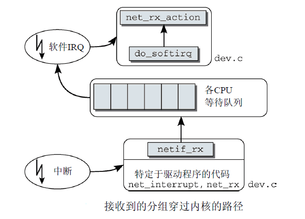
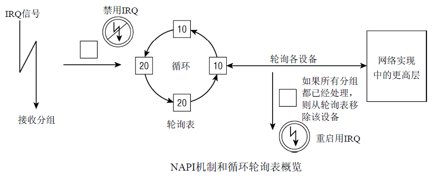

进程虚拟地址空间
=======

| 日期 | 内核版本 | 架构| 作者 | GitHub| CSDN |
| ------- |:-------:|:-------:|:-------:|:-------:|:-------:|
| 2016-06-14 | [Linux-4.7](http://lxr.free-electrons.com/source/?v=4.7) | X86 & arm | [gatieme](http://blog.csdn.net/gatieme) | [LinuxDeviceDrivers](https://github.com/gatieme/LDD-LinuxDeviceDrivers) | [Linux内存管理](http://blog.csdn.net/gatieme/article/category/6225543) |


#2	接受分组
-------


分组到达内核的时间是不可预测的. 所有现代的设备驱动程序都使用中断来通知内核(或系统)有分组到达. 网络驱动程序对特定于设备的中断设置了一个处理例程, 因此每当该中断被引发时(即分组到达), 内核都调用该处理程序, 将数据从网卡传输到物理内存, 或通知内核在一定时间后进行处理.

几乎所有的网卡都支持DMA模式, 能够自行将数据传输到物理内存. 但这些数据仍然需要解释和处理,这在稍后进行.

##2.1	传统方法
-------

当前, 内核为分组的接收提供了两个框架. 其中一个很早以前就集成到内核中了, 因而称为传统方法. 但与超高速网络适配器协作时, 该API会出现问题,因而网络子系统的开发者已经设计了一种新的API(通常称为NAPI 1). 我们首先从传统方法开始, 因为它比较易于理解. 另外, 使用旧API的适配器较多, 而使用新API的较少. 这没有问题, 因为其物理传输速度没那么高, 不需要新方法. NAPI在稍后讨论

下图出了在一个分组到达网络适配器之后,该分组穿过内核到达网络层函数的路径


因为分组是在中断上下文中接收到的, 所以处理例程只能执行一些基本的任务,避免系统(或当前CPU)的其他任务延迟太长时间.

在中断上下文中, 数据由3个短函数2处理, 执行了下列任务.




1.	net_interrupt是由设备驱动程序设置的中断处理程序. 它将确定该中断是否真的是由接收到的分组引发的(也存在其他的可能性, 例如, 报告错误或确认某些适配器执行的传输任务). 如果确实如此,则控制将转移到`net_rx`.

2.	`net_rx`函数也是特定于网卡的, 首先创建一个新的套接字缓冲区. 分组的内容接下来从网卡传输到缓冲区(也就是进入了物理内存), 然后使用内核源代码中针对各种传输类型的库函数来分析首部数据. 这项分析将确定分组数据所使用的网络层协议,例如IP协议.

3.	与上述两个方法不同, `netif_rx`函数不是特定于网络驱动程序的,该函数位于`net/core/dev.c`. 调用该函数,标志着控制由特定于网卡的代码转移到了网络层的通用接口部分.

该函数的作用在于, 将接收到的分组放置到一个特定于CPU的等待队列上, 并退出中断上下文, 使得CPU可以执行其他任务.

内核在全局定义的softnet_data数组中管理进出分组的等待队列, 数组项类型为softnet_data. 为提高多处理器系统的性能, 对每个CPU都会创建等待队列, 支持分组的并行处理.

不心使用显式的锁机制来保护等待队列免受并发访问, 因为每个CPU都只修改自身的队列, 不会干扰其他CPU的工作. 下文将忽略多处理器相关内容, 只考虑单"softnet_data等待队列", 避免过度复杂化.


定义[`include/linux/netdevice.h?v=4.7, line 2719`](http://lxr.free-electrons.com/source/include/linux/netdevice.h?v=4.7#L2719)


```cpp
//  http://lxr.free-electrons.com/source/include/linux/netdevice.h#L2719
/*
 * Incoming packets are placed on per-CPU queues
 */
struct softnet_data {
    struct list_head    poll_list;
    struct sk_buff_head     process_queue;

    /* stats */
    unsigned int        processed;
    unsigned int        time_squeeze;
    unsigned int        received_rps;
#ifdef CONFIG_RPS
    struct softnet_data     *rps_ipi_list;
#endif
#ifdef CONFIG_NET_FLOW_LIMIT
    struct sd_flow_limit __rcu *flow_limit;
#endif
    struct Qdisc        *output_queue;
    struct Qdisc        **output_queue_tailp;
    struct sk_buff      *completion_queue;

#ifdef CONFIG_RPS
    /* input_queue_head should be written by cpu owning this struct,
     * and only read by other cpus. Worth using a cache line.
     */
    unsigned int        input_queue_head ____cacheline_aligned_in_smp;

    /* Elements below can be accessed between CPUs for RPS/RFS */
    struct call_single_data csd ____cacheline_aligned_in_smp;
    struct softnet_data     *rps_ipi_next;
    unsigned int        cpu;
    unsigned int        input_queue_tail;
#endif
    unsigned int        dropped;
    struct sk_buff_head     input_pkt_queue;
    struct napi_struct      backlog;

};
```

目前只对该数据结构的一个成员`input_pkt_queue`感兴趣:


```cpp
//  http://lxr.free-electrons.com/source/include/linux/netdevice.h?v=4.7#L2753
struct softnet_data {
       struct sk_buff_head     input_pkt_queue;
}
```

*	`input_pkt_queue`使用上文提到的`sk_buff_head`表头, 对所有进入的分组建立一个链表.

*	[`netif_rx`](http://lxr.free-electrons.com/source/net/core/dev.c?v=4.7#L3830)在结束工作之前将软中断`NET_RX_SOFTIRQ`标记为即将执行, 然后退出中断上下文.

*	[`net_rx_action`](http://lxr.free-electrons.com/source/net/core/dev.c?v=4.7#L5177)用作该软中断的处理程序. 其代码流程图在图12-11给出. 请记住, 这里描述的是一个简化的版本. 完整版包含了对高速网络适配器引入的新方法, 将在下文介绍.


在一些准备任务之后,工作转移到[`process_backlog`](http://lxr.free-electrons.com/source/net/core/dev.c?v=4.7#L4809), 该函数在循环中执行下列步骤. 为简化描述, 假定循环一直进行, 直至所有的待决分组都处理完成,不会被其他情况中断.

1.	[`__skb_dequeue`](http://lxr.free-electrons.com/source/include/linux/skbuff.h?v=4.7#L1741)从等待队列移除一个套接字缓冲区, 该缓冲区管理着一个接收到的分组.

2.	由[`netif_receive_skb`](http://lxr.free-electrons.com/source/net/core/dev.c?v=4.7#L4290)函数分析分组类型, 以便根据分组类型将分组传递给网络层的接收函数(即传递到网络系统的更高一层). 为此, 该函数遍历所有可能负责当前分组类型的所有网络层函数, 一一调用[`deliver_skb`](http://lxr.free-electrons.com/source/net/core/dev.c?v=4.7#L1807).

接下来[`deliver_skb`](http://lxr.free-electrons.com/source/net/core/dev.c?v=4.7#L1807)函数使用一个特定于分组类型的处理程序[`func`](http://lxr.free-electrons.com/source/include/linux/netdevice.h?v=4.7#L2131), 承担对分组的更高层(例如互联网络层)的处理.

[`netif_receive_skb`](http://lxr.free-electrons.com/source/net/core/dev.c?v=4.7#L4290)也处理诸如桥接之类的专门特性, 但讨论这些边角情况是不必要的, 至少在平均水准的系统中, 此类特性都属于边缘情况.

所有用于从底层的网络访问层接收数据的网络层函数都注册在一个散列表中, 通过全局数组[`ptype_base`](http://lxr.free-electrons.com/source/net/core/dev.c?v=4.7#L153)实现.

新的协议通过[`dev_add_pack`](http://lxr.free-electrons.com/source/net/core/dev.c?v=4.7#L397)增加. 各个数组项的类型为[`struct packet_type`](http://lxr.free-electrons.com/source/include/linux/netdevice.h?v=4.7#L2128), 定义如下:

```cpp
//  http://lxr.free-electrons.com/source/include/linux/netdevice.h?v=4.7#L2128
struct packet_type {
    __be16          type;   /* This is really htons(ether_type). */
    struct net_device       *dev;   /* NULL is wildcarded here       */
    int             (*func) (struct sk_buff *,
                     struct net_device *,
                     struct packet_type *,
                     struct net_device *);
    bool            (*id_match)(struct packet_type *ptype,
                        struct sock *sk);
    void            *af_packet_priv;
    struct list_head    list;
};
```

| 字段 | 描述 |
|:---:|:----:|
| type | 指定了协议的标识符,处理程序会使用该标识符 |
| dev | 将一个协议处理程序绑定到特定的网卡(NULL 指针表示该处理程序对系统中所有网络设备都有效) |
| func | 是该结构的主要成员。它是一个指向网络层函数的指针,如果分组的类型适当,将其传递给该函数. 其中一个处理程序就是 ip_rcv ,用于基于IPv4的协议,在下文讨论 |

`netif_receive_skb`对给定的套接字缓冲区查找适当的处理程序, 并调用其`func`函数, 将处理分组的职责委托给网络层, 这是网络实现中更高的一层.


##2.2	对高速接口的支持
-------


###2.2.1	NAPI机制与轮询
-------


如果设备不支持过高的传输率, 那么此前讨论的旧式方法可以很好地将分组从网络设备传输到内核的更高层. 每次一个以太网帧到达时, 都使用一个IRQ来通知内核.

这里暗含着"快"和"慢"的概念. 对低速设备来说, 在下一个分组到达之前, IRQ的处理通常已经结束. 由于下一个分组也通过IRQ通知, 如果前一个分组的IRQ尚未处理完成, 则会导致问题, 高速设备通常就是这样. 现代以太网卡的运作高达`10000 Mbit/s`, 如果使用旧式方法来驱动此类设备, 将造成所谓的"中断风暴". 如果在分组等待处理时接收到新的IRQ, 内核不会收到新的信息 : 在分组进入处理过程之前, 内核是可以接收IRQ的, 在分组的处理结束后, 内核也可以接收IRQ, 这些不过是"旧闻"而已. 为解决该问题, NAPI使用了IRQ和轮询的组合.

假定某个网络适配器此前没有分组到达, 但从现在开始, 分组将以高频率频繁到达. 这就是NAPI设备的情况, 如下所述.

1.	第一个分组将导致网络适配器发出IRQ. 为防止进一步的分组导致发出更多的IRQ, 驱动程序会关闭该适配器的Rx IRQ. 并将该适配器放置到一个轮询表上.

2.	只要适配器上还有分组需要处理, 内核就一直对轮询表上的设备进行轮询.

3.	重新启用Rx中断.


如果在新的分组到达时, 旧的分组仍然处于处理过程中, 工作不会因额外的中断而减速. 虽然对设备驱动程序(和一般意义上的内核代码)来说轮询通常是一个很差的方法, 但在这里该方法没有什么不利之处:在没有分组还需要处理时,将停止轮询,设备将回复到通常的IRQ驱动的运行方式. 在没有中断支持的情况下, 轮询空的接收队列将不必要地浪费时间, 但NAPI并非如此.

NAPI的另一个优点是可以高效地丢弃分组. 如果内核确信因为有很多其他工作需要处理, 而导致无法处理任何新的分组,那么网络适配器可以直接丢弃分组,无须复制到内核.


只有设备满足如下两个条件时,才能实现NAPI方法.

1.	设备必须能够保留多个接收的分组,例如保存到DMA环形缓冲区中. 下文将该缓冲区称为Rx缓冲区.

2.	该设备必须能够禁用用于分组接收的IRQ. 而且, 发送分组或其他可能通过IRQ进行的操作, 都仍然必须是启用的。

如果系统中有多个设备, 会怎么样呢? 这是通过循环轮询各个设备来解决的. 图12-12概述了这种情况.




回想前文提到的, 如果一个分组到达一个空的Rx缓冲区, 则将相应的设备置于轮询表中. 由于链表本身的性质, 轮询表可以包含多个设备.

内核以循环方式处理链表上的所有设备 : 内核依次轮询各个设备, 如果已经花费了一定的时间来处理某个设备, 则选择下一个设备进行处理. 此外, 某个设备都带有一个相对权重, 表示与轮询表中其他设备相比, 该设备的相对重要性. 较快的设备权重较大,较慢的设备权重较小. 由于权重指定了在一个轮询的循环中处理多少分组, 这确保了内核将更多地注意速度较快的设备.


###2.2.2	napi机制的实现细节
-------


现在我们已经弄清楚了NAPI的基本原理, 接下来将讨论其实现细节. 与旧的API相比, 关键性的变化在于, 支持NAPI的设备必须提供一个 poll函数. 该方法是特定于设备的, 在用`netif_napi_add`注册网卡时指定. 调用该函数注册, 表明设备可以且必须用新方法处理.

```CPP
/**
 *      netif_napi_add - initialize a NAPI context
 *      @dev:  network device
 *      @napi: NAPI context
 *      @poll: polling function
 *      @weight: default weight
 *
 * netif_napi_add() must be used to initialize a NAPI context prior to calling
 * *any* of the other NAPI-related functions.
 */
void netif_napi_add(
	struct net_device *dev,
	struct napi_struct *napi,
	int (*poll)(struct napi_struct *, int),
	int weight);
```

| 参数 | 描述 |
|:----:|:----:|
| dev | 指向所述设备的`net_device`实例 |
| napi | 该结构用于管理轮询表上的设备 |
| poll | 指定了在IRQ禁用时用来轮询设备的函数 |
| weight | 指定了设备接口的相对权重。实际上可以对 weight 指定任意整数值。通常10/100 Mbit网卡的驱动程序, 指定为16,而1 000/10 000 Mbit网卡的驱动程序指定为64。无论如何,权重都不能超过该设备可以在Rx缓冲区中存储的分组的数目 |


`netif_napi_add`还需要另一个参数,是一个指向`struct napi_struct`实例的指针. 该结构用于管理轮询表上的设备. 其定义如下 :

```cpp
/*
 * Structure for NAPI scheduling similar to tasklet but with weighting
 */
struct napi_struct {
    /* The poll_list must only be managed by the entity which
     * changes the state of the NAPI_STATE_SCHED bit.  This means
     * whoever atomically sets that bit can add this napi_struct
     * to the per-CPU poll_list, and whoever clears that bit
     * can remove from the list right before clearing the bit.
     */
    struct list_head    poll_list;

    unsigned long       state;
    int             weight;
    unsigned int        gro_count;
    int             (*poll)(struct napi_struct *, int);
#ifdef CONFIG_NETPOLL
    spinlock_t          poll_lock;
    int             poll_owner;
#endif
    struct net_device       *dev;
    struct sk_buff      *gro_list;
    struct sk_buff      *skb;
    struct hrtimer      timer;
    struct list_head    dev_list;
    struct hlist_node       napi_hash_node;
    unsigned int        napi_id;
};
```

轮询表通过一个标准的内核双链表实现, `poll_list`用作链表元素. `weight`和 `poll`的语义同上文所述. `state` 以是`NAPI_STATE_SCHED`或`NAPI_STATE_DISABLE`, 前者表示设备将在内核的下一次循环时被轮询, 后者表示轮询已经结束且没有更多的分组等待处理,但设备尚未从轮询表移除.

请注意, `struct napi_struct`经常嵌入到一个更大的结构中,后者包含了与网卡有关的、特定于驱动程序的数据. 这样在内核使用`poll`函数轮询网卡时,可用 `container_of`机制获得相关信息.


##2.2.3	实现poll函数
-------


`poll`函数需要两个参数 : 一个指向`napi_struct`实例的指针和一个指定了"预算"的整数, 预算表示内核允许驱动程序处理的分组数目.

我们并不打算处理真实网卡的可能的奇异之处, 因此讨论一个伪函数, 该函数用于一个需要`NAPI`的超高速适配器 :


```cpp
static int hyper_card_poll(struct napi_struct *napi, int budget)
{
	struct nic *nic = container_of(napi, struct nic, napi);
	struct net_device *netdev = nic->netdev;
	int work_done;
	work_done = hyper_do_poll(nic, budget);
	if (work_done < budget) 
    {
		netif_rx_complete(netdev, napi);
		hcard_reenable_irq(nic);
	}
	return work_done;
}
```


在从`napi_struct`的容器获得特定于设备的信息之后, 调用一个特定于硬件的方法(这里是`hyper_do_poll`)来执行所需要的底层操作从网络适配器获取分组, 并使用像此前那样使用`netif_receive_skb`将分组传递到网络实现中更高的层.

`hyper_do_poll`最多允许处理`budget`个分组. 该函数返回实际上处理的分组的数目. 必须区分以下两种情况.

*	如果处理分组的数目小于预算, 那么没有更多的分组, Rx缓冲区为空, 否则, 肯定还需要处理剩余的分组(亦即，返回值不可能小于预算). 因此，netif_rx_complete将该情况通知内核，内核将从轮询表移除该设备。接下来，驱动程序必须通过特定于硬件的适当方法来重新启用IRQ.

*	已经完全用掉了预算，但仍然有更多的分组需要处理。设备仍然留在轮询表上，不启用中断.


###2.2.4	实现IRQ处理程序
-------

NAPI也需要对网络设备的IRQ处理程序做一些改动. 这里仍然不求助于任何具体的硬件, 而介绍针对虚构设备的代码:


```cpp
static irqreturn_t e100_intr(int irq, void *dev_id)
{
    struct net_device *netdev = dev_id;
    struct nic *nic = netdev_priv(netdev);
    u8 stat_ack = ioread8(&nic->csr->scb.stat_ack);

    netif_printk(nic, intr, KERN_DEBUG, nic->netdev,
             "stat_ack = 0x%02X\n", stat_ack);

    if (stat_ack == stat_ack_not_ours ||    /* Not our interrupt */
       stat_ack == stat_ack_not_present)    /* Hardware is ejected */
        return IRQ_NONE;

    /* Ack interrupt(s) */
    iowrite8(stat_ack, &nic->csr->scb.stat_ack);

    /* We hit Receive No Resource (RNR); restart RU after cleaning */
    if (stat_ack & stat_ack_rnr)
        nic->ru_running = RU_SUSPENDED;

    if (likely(napi_schedule_prep(&nic->napi))) {
        e100_disable_irq(nic);
        __napi_schedule(&nic->napi);
    }

    return IRQ_HANDLED;
}
```


假定特定于接口的数据保存在`net_device->private`中, 这是大多数网卡驱动程序使用的方法.

使用辅助函数`netdev_priv`访问该字段.

现在需要通知内核有新的分组可用. 这需要如下二阶段的方法.

1.	`netif_rx_schedule_prep`准备将设备放置到轮询表上. 本质上, 这会安置`napi_struct->flags`中的`NAPI_STATE_SCHED`标志.

2.	如果设置该标志成功(仅当NAPI已经处于活跃状态时, 才会失败), 驱动程序必须用特定于设备的适当方法来禁用相应的IRQ. 调用`__netif_rx_schedule`将设备的`napi_struct`添加到轮询表, 并引发软中断`NET_RX_SOFTIRQ`. 这通知内核在`net_rx_action`中开始轮询.


###2.2.5	处理Rx软中断
-------

在讨论了为支持NAPI驱动程序需要做哪些改动之后, 我们来考察一下内核需要承担的职责.

`net_rx_action`依旧是软中断`NET_RX_SOFTIRQ`的处理程序. 在前一节给出了该函数的一个简化版本.

随着有关NAPI的更多细节尘埃落定, 现在可以讨论该函数的所有细节了.


本质上, 内核通过依次调用各个设备特定的poll方法, 处理轮询表上当前的所有设备. 设备的权重用作该设备本身的预算, 即轮询的一步中可能处理的分组数目.

必须确保在这个软中断的处理程序中, 不会花费过多时间. 如果如下两个条件成立, 则放弃处理.

1.	处理程序已经花费了超出一个jiffie的时间.

2.	所处理分组的总数, 已经超过了`netdev_budget`指定的预算总值. 通常, 总值设置为300, 但可以通过`/proc/sys/net/core/netdev_budget`修改.

这个预算不能与各个网络设备本身的预算混淆! 在每个轮询步之后, 都从全局预算中减去处理的分组数目, 如果该预算值下降到0, 则退出软中断处理程序.

在轮询了一个设备之后, 内核会检查所处理的分组数目, 与该设备的预算是否相等.

如果相等, 那么尚未获得该设备上所有等待的分组, 即代码流程图中`work == weight`所表示的情况. 内核接下来将该设备移动到轮询表末尾, 在链表中所有其他设备都处理过之后, 继续轮询该设备. 显然, 这实现了网络设备之间的循环调度.

###2.2.6	在NAPI之上实现旧式API
-------


最后, 请注意旧的API是如何在NAPI上实现的. 内核的常规行为, 由一个与`softnet`队列关联的伪网络设备控制, `net/core/dev.c`中的`process_backlog`标准函数用作poll方法. 如果没有网络适配器将其自身添加到该队列的轮询表, 其中只包含这个伪适配器, 那么net_rx_action的行为就是通过对`process_backlog`的单一调用来处理队列中的分组, 而不管分组的来源设备.


