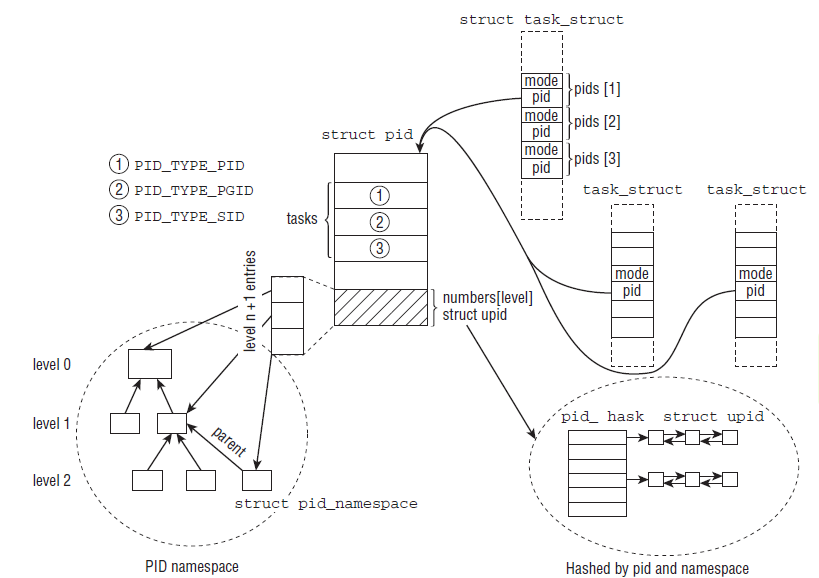
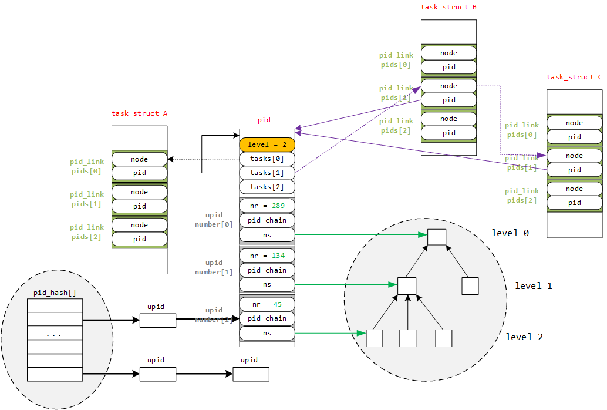

Linux进程ID号--Linux进程的管理与调度（三）
=======


| 日期 | 内核版本 | 架构| 作者 | GitHub| CSDN |
| ------------- |:-------------:|:-------------:|:-------------:|:-------------:|:-------------:|
| 2016-05-12 | [Linux-4.5](http://lxr.free-electrons.com/source/?v=4.5) | X86 & arm | [gatieme](http://blog.csdn.net/gatieme) | [LinuxDeviceDrivers](https://github.com/gatieme/LDD-LinuxDeviceDrivers) | [Linux-进程管理与调度](http://blog.csdn.net/gatieme/article/category/6225543) |


Linux 内核使用 task_struct 数据结构来关联所有与进程有关的数据和结构，Linux 内核所有涉及到进程和程序的所有算法都是围绕该数据结构建立的，是内核中最重要的数据结构之一。

该数据结构在内核文件[include/linux/sched.h](http://lxr.free-electrons.com/source/include/linux/sched.h#L1389)中定义，在目前最新的Linux-4.5（截至目前的日期为2016-05-11）的内核中，该数据结构足足有 380 行之多，在这里我不可能逐项去描述其表示的含义，本篇文章只关注该数据结构如何来组织和管理进程ID的。

#进程ID概述
-------

##进程ID类型
-------

要想了解内核如何来组织和管理进程ID，先要知道进程ID的类型：

内核中进程ID的类型用[pid_type](http://lxr.free-electrons.com/source/include/linux/pid.h#L6)来描述,它被定义在[include/linux/pid.h](http://lxr.free-electrons.com/source/include/linux/pid.h)中

```c
enum pid_type
{
    PIDTYPE_PID,
    PIDTYPE_PGID,
    PIDTYPE_SID,
    PIDTYPE_MAX
};
```

*    **PID**    内核唯一区分每个进程的标识

<font  color=#0099ff>
pid是 Linux 中在其命名空间中唯一标识进程而分配给它的一个号码，称做进程ID号，简称PID。在使用 fork 或 clone 系统调用时产生的进程均会由内核分配一个新的唯一的PID值
</font>

这个pid用于内核唯一的区分每个进程

>注意它并不是我们用户空间通过getpid( )所获取到的那个进程号，至于原因么，接着往下看

*    **TGID**    线程组（轻量级进程组）的ID标识

在一个进程中，如果以CLONE_THREAD标志来调用clone建立的进程就是该进程的一个线程（即轻量级进程，Linux其实没有严格的进程概念），它们处于一个线程组，

<font  color=#0099ff>
该线程组的所有线程的ID叫做TGID。处于相同的线程组中的所有进程都有相同的TGID，但是由于他们是不同的进程，因此其pid各不相同；线程组组长（也叫主线程）的TGID与其PID相同；一个进程没有使用线程，则其TGID与PID也相同。
</font>

*    **PGID**    

另外，<font  color=#0099ff>独立的进程可以组成进程组（使用setpgrp系统调用），进程组可以简化向所有组内进程发送信号的操作</font>

例如用管道连接的进程处在同一进程组内。进程组ID叫做PGID，进程组内的所有进程都有相同的PGID，等于该组组长的PID。

*    **SID**

<font  color=#0099ff>几个进程组可以合并成一个会话组（使用setsid系统调用），可以用于终端程序设计。会话组中所有进程都有相同的SID,保存在task_struct的session成员中</font>


##PID命名空间
-------

###pid命名空间概述
-------

命名空间是为操作系统层面的虚拟化机制提供支撑，目前实现的有六种不同的命名空间，分别为mount命名空间、UTS命名空间、IPC命名空间、用户命名空间、PID命名空间、网络命名空间。命名空间简单来说提供的是对全局资源的一种抽象，将资源放到不同的容器中（不同的命名空间），各容器彼此隔离。

>关于命名空间的详细信息，请参见 

命名空间有的还有层次关系，如PID命名空间


>在上图有四个命名空间，一个父命名空间衍生了两个子命名空间，其中的一个子命名空间又衍生了一个子命名空间。以PID命名空间为例，由于各个命名空间彼此隔离，所以每个命名空间都可以有 PID 号为 1 的进程；但又由于命名空间的层次性，父命名空间是知道子命名空间的存在，因此子命名空间要映射到父命名空间中去，因此上图中 level 1 中两个子命名空间的六个进程分别映射到其父命名空间的PID 号5~10。

###局部ID和全局ID
-------


命名空间增加了PID管理的复杂性。


回想一下，PID命名空间按层次组织。在建立一个新的命名空间时，该命名空间中的所有PID对父命名空间都是可见的，但子命名空间无法看到父命名空间的PID。但这意味着某些进程具有多个PID，凡可以看到该进程的命名空间，都会为其分配一个PID。 这必须反映在数据结构中。我们必须区分**局部ID**和**全局ID**


全局PID和TGID直接保存在[`task_struct`](http://lxr.free-electrons.com/source/include/linux/sched.h#L1389)中，分别是task_struct的`pid`和`tgid`成员：


*    **全局ID**    在内核本身和初始命名空间中唯一的ID，在系统启动期间开始的 init 进程即属于该初始命名空间。系统中每个进程都对应了该命名空间的一个PID，叫全局ID，保证在整个系统中唯一。

*    **局部ID**    对于属于某个特定的命名空间，它在其命名空间内分配的ID为局部ID，该ID也可以出现在其他的命名空间中。

```c
<sched.h> 
struct task_struct
{  
		//...  
        pid_t pid;  
        pid_t tgid;  
		//...  
}
```
 
两项都是pid_t类型，该类型定义为__kernel_pid_t，后者由各个体系结构分别定义。通常定义为int，即可以同时使用232个不同的ID。

会话session和进程group组ID不是直接包含在task_struct本身中，但保存在用于信号处理的结构中。


>task_ struct->signal->__session表示全局SID，
>
>而全局PGID则保存在task_struct->signal->__pgrp。
>
>辅助函数set_task_session和set_task_pgrp可用于修改这些值。


除了这两个字段之外，内核还需要找一个办法来管理所有命名空间内部的局部量，以及其他ID（如TID和SID）。这需要几个相互连接的数据结构，以及许多辅助函数，并将在下文讨论。

下文我将使用ID指代提到的任何进程ID。在必要的情况下，我会明确地说明ID类型（例如，TGID，即线程组ID）。

一个小型的子系统称之为PID分配器（pid allocator）用于加速新ID的分配。此外，内核需要提供辅助函数，以实现通过ID及其类型查找进程的task_struct的功能，以及将ID的内核表示形式和用户空间可见的数值进行转换的功能。


###PID命名空间数据结构pid_namespace

-------


在介绍表示ID本身所需的数据结构之前，我需要讨论PID命名空间的表示方式。我们所需查看的代码如下所示：

[pid_namespace](http://lxr.free-electrons.com/source/include/linux/pid_namespace.h#L24)的定义在[include/linux/pid_namespace.h](http://lxr.free-electrons.com/source/include/linux/pid_namespace.h#L24)中

命名空间的结构如下

```c
struct pid_namespace
{  

    struct kref kref;  
    struct pidmap pidmap[PIDMAP_ENTRIES];  
    int last_pid;  
    struct task_struct *child_reaper;  
    struct kmem_cache *pid_cachep;  
    unsigned int level;  
    struct pid_namespace *parent;
}; 
```

>我们这里只关心其中的child_reaper，level和parent这三个字段


| 字段| 描述 | 
| ------------- |:-------------:|
| kref | 表示指向pid_namespace的个数 |
| pidmap | pidmap结构体表示分配pid的位图。当需要分配一个新的pid时只需查找位图，找到bit为0的位置并置1，然后更新统计数据域（nr_free) |
| last_pid | 用于pidmap的分配。指向最后一个分配的pid的位置。(不是特别确定）|
| child_reaper | 指向的是当前命名空间的init进程，每个命名空间都有一个作用相当于全局init进程的进程 |
| pid_cachep | 域指向分配pid的slab的地址。|
| level | 代表当前命名空间的等级，初始命名空间的level为0，它的子命名空间level为1，依次递增，而且子命名空间对父命名空间是可见的。从给定的level设置，内核即可推断进程会关联到多少个ID。|
| parent | 指向父命名空间的指针 |


实际上PID分配器也需要依靠该结构的某些部分来连续生成唯一ID，但我们目前对此无需关注。我们上述代码中给出的下列成员更感兴趣。

每个PID命名空间都具有一个进程，其发挥的作用相当于全局的init进程。init的一个目的是对孤儿进程调用wait4，命名空间局部的init变体也必须完成该工作。

#pid结构描述
-------


##pid与upid
-------

PID的管理围绕两个数据结构展开：

*    [struct pid](http://lxr.free-electrons.com/source/include/linux/pid.h#L57)是内核对PID的内部表示，

*    [struct upid](http://lxr.free-electrons.com/source/include/linux/pid.h#L50)则表示特定的命名空间中可见的信息。


两个结构的定义在[include/linux/pid.h](include/linux/pid.h)中


```c
struct upid
{  
    /* Try to keep pid_chain in the same cacheline as nr for find_vpid */
        int nr;  
        struct pid_namespace *ns;  
        struct hlist_node pid_chain;  
};  
```

| 字段| 描述 | 
| ------------- |:-------------:|
| nr | 表示ID具体的值 |
| ns | 指向命名空间的指针 |
| pid_chain | 指向PID哈希列表的指针，用于关联对于的PID |


>所有的upid实例都保存在一个散列表中，稍后我们会看到该结构。

```c
struct pid  
{  
        atomic_t count;  
        /* 使用该pid的进程的列表， lists of tasks that use this pid  */
        struct hlist_head tasks[PIDTYPE_MAX];  
        int level;  
        struct upid numbers[1];  
};
```

| 字段| 描述 | 
| ------------- |:-------------:|
| count | 是指使用该PID的task的数目；|
| level | 表示可以看到该PID的命名空间的数目，也就是包含该进程的命名空间的深度 |
| tasks[PIDTYPE_MAX] | 是一个数组，每个数组项都是一个散列表头,分别对应以下三种类型
| numbers[1] | 一个upid的实例数组，每个数组项代表一个命名空间，用来表示一个PID可以属于不同的命名空间，该元素放在末尾，可以向数组添加附加的项。|

>tasks是一个数组，每个数组项都是一个散列表头，对应于一个ID类型,PIDTYPE_PID, PIDTYPE_PGID, PIDTYPE_SID（ PIDTYPE_MAX表示ID类型的数目）这样做是必要的，因为一个ID可能用于几个进程。所有共享同一给定ID的task_struct实例，都通过该列表连接起来。
>   
>这个枚举常量PIDTYPE_MAX，正好是pid_type类型的数目，这里linux内核使用了一个小技巧来由编译器来自动生成id类型的数目


此外，还有两个结构我们需要说明，就是pidmap和pid_link

*	pidmap当需要分配一个新的pid时查找可使用pid的位图，其定义如下

*	而pid_link则是pid的哈希表存储结构

##pidmap用于分配pid的位图
-------

```c
struct pidmap
{  
	atomic_t nr_free;  
	void *page; 
};
```

| 字段| 描述 | 
| ------------- |:-------------:|
| nr_free | 表示还能分配的pid的数量 |
| page | 指向的是存放pid的物理页 |


>pidmap[PIDMAP_ENTRIES]域表示该pid_namespace下pid已分配情况

##pid_link哈希表存储
-------

pids[PIDTYPE_MAX]指向了和该task_struct相关的pid结构体。
pid_link的定义如下
```c
struct pid_link  
{  
struct hlist_node node;  
struct pid *pid;  
};
```


##task_struct中进程ID相关数据结构
-------

##task_struct中的描述符信息
-------
```c
struct task_struct  
{  
    //...  
    pid_t pid;  
    pid_t tgid;  
    struct task_struct *group_leader;  
    struct pid_link pids[PIDTYPE_MAX];  
    struct nsproxy *nsproxy;  
    //...  
};
```
| 字段| 描述 | 
| ------------- |:-------------:|
| pid | 指该进程的进程描述符。在fork函数中对其进行赋值的 |
| tgid | 指该进程的线程描述符。在linux内核中对线程并没有做特殊的处理，还是由task_struct来管理。所以从内核的角度看， 用户态的线程本质上还是一个进程。对于同一个进程（用户态角度）中不同的线程其tgid是相同的，但是pid各不相同。 主线程即group_leader（主线程会创建其他所有的子线程）。如果是单线程进程（用户态角度），它的pid等于tgid。|
| group_leader | 除了在多线程的模式下指向主线程，还有一个用处， 当一些进程组成一个群组时（PIDTYPE_PGID)， 该域指向该群组的leader |
| nsproxy | 指针指向namespace相关的域，通过nsproxy域可以知道该task_struct属于哪个pid_namespace |

>对于用户态程序来说，调用getpid（）函数其实返回的是tgid，因此线程组中的进程id应该是是一致的，但是他们pid不一致，这也是内核区分他们的标识


1.    多个task_struct可以共用一个PID

2.    一个PID可以属于不同的命名空间

3.	当需要分配一个新的pid时候，只需要查找pidmap位图即可

那么最终，linux下进程命名空间和进程的关系结构如下：



可以看到，多个task_struct指向一个PID，同时PID的hash数组里安装不同的类型对task进行散列，并且一个PID会属于多个命名空间。


#内核是如何设计task_struct中进程ID相关数据结构的
-------

>本部内容较多的采用了[Linux 内核进程管理之进程ID](http://www.cnblogs.com/hazir/p/linux_kernel_pid.html)

Linux 内核在设计管理ID的数据结构时，要充分考虑以下因素：

1.    如何快速地根据进程的 task_struct、ID类型、命名空间找到局部ID

2.    如何快速地根据局部ID、命名空间、ID类型找到对应进程的 task_struct

3.    如何快速地给新进程在可见的命名空间内分配一个唯一的 PID

如果将所有因素考虑到一起，将会很复杂，下面将会由简到繁设计该结构。

##一个PID对应一个task时的task_struct设计
-------

一个PID对应一个`task_struct`如果先不考虑进程之间的关系，不考虑命名空间，仅仅是一个PID号对应一个`task_struct`，那么我们可以设计这样的数据结构

```c
struct task_struct
{
    //...
    struct pid_link pids;   
    //...
};

struct pid_link
{
    struct hlist_node node;
    struct pid *pid;
};

struct pid
{
    struct hlist_head tasks; //指回 pid_link 的 node
    int nr; //PID
    struct hlist_node pid_chain; //pid hash 散列表结点
};
```
每个进程的 task_struct 结构体中有一个指向 pid 结构体的指针，pid结构体包含了PID号。

结构示意图如图


#如何快速地根据局部ID、命名空间、ID类型找到对应进程的 task_struct
-------
图中还有两个结构上面未提及：

>*    pid_hash[]
>
>这是一个hash表的结构，根据pid的nr值哈希到其某个表项，若有多个 pid 结构对应到同一个表项，这里解决冲突使用的是散列表法。

这样，就能解决开始提出的第2个问题了，根据PID值怎样快速地找到task_struct结构体：

1.    首先通过 PID 计算 pid 挂接到哈希表 pid_hash[] 的表项

2.    遍历该表项，找到 pid 结构体中 nr 值与 PID 值相同的那个 pid

3.    再通过该 pid 结构体的 tasks 指针找到 node

4.    最后根据内核的 container_of 机制就能找到 task_struct 结构体

#如何快速地给新进程在可见的命名空间内分配一个唯一的 PID
-------

>*    pid_map
>
>这是一个位图，用来唯一分配PID值的结构，图中灰色表示已经分配过的值，在新建一个进程时，只需在其中找到一个为分配过的值赋给 pid 结构体的 nr，再将pid_map 中该值设为已分配标志。这也就解决了上面的**第3个问题——如何快速地分配一个全局的PID**

至于上面的**第1个问题*就更加简单，已知 task_struct 结构体，根据其 pid_link 的 pid 指针找到 pid 结构体，取出其 nr 即为 PID 号。

##带进程ID类型的task_struct设计
-------

如果考虑进程之间有复杂的关系，如线程组、进程组、会话组，这些组均有组ID，分别为 TGID、PGID、SID，所以原来的 task_struct 中pid_link 指向一个 pid 结构体需要增加几项，用来指向到其组长的 pid 结构体，相应的 struct pid 原本只需要指回其 PID 所属进程的task_struct，现在要增加几项，用来链接那些以该 pid 为组长的所有进程组内进程。数据结构如下：

>定义在http://lxr.free-electrons.com/source/include/linux/sched.h#L1389


```c
enum pid_type
{
    PIDTYPE_PID,
    PIDTYPE_PGID,
    PIDTYPE_SID,
    PIDTYPE_MAX
};

struct task_struct
{
    //...
    pid_t pid; //PID
    pid_t tgid; //thread group id
    //..
    struct pid_link pids[PIDTYPE_MAX];    
    struct task_struct *group_leader; // threadgroup leader
    //...
    struct pid_link pids[PIDTYPE_MAX];  
    struct nsproxy *nsproxy;  
};

struct pid_link
{
    struct hlist_node node;
    struct pid *pid;
};

struct pid
{
    struct hlist_head tasks[PIDTYPE_MAX];
    int nr; //PID
    struct hlist_node pid_chain; // pid hash 散列表结点
};
```

上面 ID 的类型 PIDTYPE_MAX 表示 ID 类型数目。之所以不包括线程组ID，是因为内核中已经有指向到线程组的 task_struct 指针 group_leader，线程组 ID 无非就是 group_leader 的PID。


假如现在有三个进程A、B、C为同一个进程组，进程组长为A，这样的结构示意图如图


关于上图有几点需要说明：

图中省去了 pid_hash 以及 pid_map 结构，因为第一种情况类似；

进程B和C的进程组组长为A，那么 pids[PIDTYPE_PGID] 的 pid 指针指向进程A的 pid 结构体；

进程A是进程B和C的组长，进程A的 pid 结构体的 tasks[PIDTYPE_PGID] 是一个散列表的头，它将所有以该pid 为组长的进程链接起来。

再次回顾本节的三个基本问题，在此结构上也很好去实现。

#进一步增加进程PID命名空间的task_struct设计
-------

若在第二种情形下再增加PID命名空间

一个进程就可能有多个PID值了，因为在每一个可见的命名空间内都会分配一个PID，这样就需要改变 pid 的结构了，如下：
```c
struct pid
{
    unsigned int level;
    /* lists of tasks that use this pid */
    struct hlist_head tasks[PIDTYPE_MAX];
    struct upid numbers[1];
};

struct upid
{
    int nr;
    struct pid_namespace *ns;
    struct hlist_node pid_chain;
};
```

在 pid 结构体中增加了一个表示该进程所处的命名空间的层次level，以及一个可扩展的 upid 结构体。对于struct upid，表示在该命名空间所分配的进程的ID，ns指向是该ID所属的命名空间，pid_chain 表示在该命名空间的散列表。

举例来说，在level 2 的某个命名空间上新建了一个进程，分配给它的 pid 为45，映射到 level 1 的命名空间，分配给它的 pid 为 134；再映射到 level 0 的命名空间，分配给它的 pid 为289，对于这样的例子，如图4所示为其表示：





图中关于如果分配唯一的 PID 没有画出，但也是比较简单，与前面两种情形不同的是，这里分配唯一的 PID 是有命名空间的容器的，在PID命名空间内必须唯一，但各个命名空间之间不需要唯一。
至此，已经与 Linux 内核中数据结构相差不多了。


#进程ID管理函数
-------

有了上面的复杂的数据结构，再加上散列表等数据结构的操作，就可以写出我们前面所提到的三个问题的函数了：

##pid号到struct pid实体
-------

很多时候在写内核模块的时候，需要通过进程的pid找到对应进程的task_struct，其中首先就需要通过进程的pid找到进程的struct pid，
然后再通过struct pid找到进程的task_struct

我知道的实现函数有三个。

```c
struct pid *find_pid_ns(int nr, struct pid_namespace *ns)
struct pid *find_vpid(int nr)
struct pid *find_get_pid(pid_t nr)
```


find_pid_ns获得 pid 实体的实现原理，主要使用哈希查找。内核使用哈希表组织struct pid，每创建一个新进程，给进程的struct pid都会插入到哈希表中，这时候就需要使用进程
的进程pid和命名ns在哈希表中将相对应的struct pid索引出来，现在可以看下find_pid_ns的传入参数，也是通过nr和ns找到struct pid。

根据局部PID以及命名空间计算在 pid_hash 数组中的索引，然后遍历散列表找到所要的 upid， 再根据内核的 container_of 机制找到 pid 实例。

代码如下：

```c
struct pid *find_pid_ns(int nr, struct pid_namespace *ns)
{
        struct hlist_node *elem;
        struct upid *pnr; 

        hlist_for_each_entry_rcu(pnr, elem,
                        &pid_hash[pid_hashfn(nr, ns)], pid_chain)
                if (pnr->nr == nr && pnr->ns == ns)
                        return container_of(pnr, struct pid,
                                        numbers[ns->level]);

        return NULL;
}
```

而另外两个函数则是对其进行进一步的封装，如下

```c
struct pid *find_vpid(int nr)
{
        return find_pid_ns(nr, current->nsproxy->pid_ns);
}
struct pid *find_get_pid(pid_t nr)
{ 
        struct pid *pid; 

        rcu_read_lock();
        pid = get_pid(find_vpid(nr)); 
        rcu_read_unlock();

        return pid; 
}
```

三者之间的调用关系如下


由图可以看出，find_pid_ns是最终的实现，find_vpid是使用find_pid_ns
实现的，find_get_pid又是由find_vpid实现的。

由原代码可以看出find_vpid和find_pid_ns是一样的，而find_get_pid和find_vpid有一点差异，就是使用find_get_pid将返回的struct pid中的字段count加1，而find_vpid没有加1。


##获得局部ID
-------

根据进程的 task_struct、ID类型、命名空间，可以很容易获得其在命名空间内的局部ID

获得与task_struct 关联的pid结构体。辅助函数有 task_pid、task_tgid、task_pgrp和task_session，分别用来获取不同类型的ID的pid 实例，如获取 PID 的实例：

```c
static inline struct pid *task_pid(struct task_struct *task)
{
	return task->pids[PIDTYPE_PID].pid;
}
```

获取线程组的ID，前面也说过，TGID不过是线程组组长的PID而已，所以：
```c
static inline struct pid *task_tgid(struct task_struct *task)
{
	return task->group_leader->pids[PIDTYPE_PID].pid;
}
```

而获得PGID和SID，首先需要找到该线程组组长的task_struct，再获得其相应的 pid：

```c
static inline struct pid *task_pgrp(struct task_struct *task)
{
	return task->group_leader->pids[PIDTYPE_PGID].pid;
}

static inline struct pid *task_session(struct task_struct *task)
{
	return task->group_leader->pids[PIDTYPE_SID].pid;
}
```

获得 pid 实例之后，再根据 pid 中的numbers 数组中 uid 信息，获得局部PID。


```c
pid_t pid_nr_ns(struct pid *pid, struct pid_namespace *ns)
{
	struct upid *upid;
	pid_t nr = 0;
	if (pid && ns->level <= pid->level)
    {
		upid = &pid->numbers[ns->level];
		if (upid->ns == ns)
			nr = upid->nr;
	}
	return nr;
}
```

这里值得注意的是，由于PID命名空间的层次性，父命名空间能看到子命名空间的内容，反之则不能，因此，函数中需要确保当前命名空间的level 小于等于产生局部PID的命名空间的level。

除了这个函数之外，内核还封装了其他函数用来从 pid 实例获得 PID 值，如 pid_nr、pid_vnr 等。在此不介绍了。
结合这两步，内核提供了更进一步的封装，提供以下函数：

```c
pid_t task_pid_nr_ns(struct task_struct *tsk, struct pid_namespace *ns);
pid_t task_tgid_nr_ns(struct task_struct *tsk, struct pid_namespace *ns);
pid_t task_pigd_nr_ns(struct task_struct *tsk, struct pid_namespace *ns);
pid_t task_session_nr_ns(struct task_struct *tsk, struct pid_namespace *ns);
```
从函数名上就能推断函数的功能，其实不外于封装了上面的两步。

##根据PID查找进程task_struct
-------

*	根据PID号（nr值）取得task_struct 结构体

*	根据PID以及其类型（即为局部ID和命名空间）获取task_struct结构体

如果根据的是进程的ID号，我们可以先通过ID号（nr值）获取到进程struct pid实体（局部ID），然后根据局部ID、以及命名空间，获得进程的task_struct结构体


可以使用pid_task根据pid和pid_type获取到进程的task 

```c
struct task_struct *pid_task(struct pid *pid, enum pid_type type)
{
	struct task_struct *result = NULL;
	if (pid) {
		struct hlist_node *first;
		first = rcu_dereference_check(hlist_first_rcu(&pid->tasks[type]),
		lockdep_tasklist_lock_is_held());
		if (first)
			result = hlist_entry(first, struct task_struct, pids[(type)].node);
	}
    
	return result;
}
```

那么我们根据pid号查找进程task的过程就成为
```c
pTask = pid_task(find_vpid(pid), PIDTYPE_PID);  
```

内核还提供其它函数用来实现上面两步：

```c
struct task_struct *find_task_by_pid_ns(pid_t nr, struct pid_namespace *ns);
struct task_struct *find_task_by_vpid(pid_t vnr);
struct task_struct *find_task_by_pid(pid_t vnr);
```


>由于linux进程是组织在双向链表和红黑树中的，因此我们通过遍历链表或者树也可以找到当前进程，但是这个并不是我们今天的重点


##生成唯一的PID
-------

内核中使用下面两个函数来实现分配和回收PID的：
```c
static int alloc_pidmap(struct pid_namespace *pid_ns);
static void free_pidmap(struct upid *upid);
```

在这里我们不关注这两个函数的实现，反而应该关注分配的 PID 如何在多个命名空间中可见，这样需要在每个命名空间生成一个局部ID，函数 alloc_pid 为新建的进程分配PID，简化版如下：
```c
struct pid *alloc_pid(struct pid_namespace *ns)
{
	struct pid *pid;
	enum pid_type type;
	int i, nr;
	struct pid_namespace *tmp;
	struct upid *upid;
	tmp = ns;
	pid->level = ns->level;
	// 初始化 pid->numbers[] 结构体
	for (i = ns->level; i >= 0; i--)
    {
		nr = alloc_pidmap(tmp); //分配一个局部ID
		pid->numbers[i].nr = nr;
		pid->numbers[i].ns = tmp;
		tmp = tmp->parent;
	}
	// 初始化 pid->task[] 结构体
	for (type = 0; type < PIDTYPE_MAX; ++type)
		INIT_HLIST_HEAD(&pid->tasks[type]);
	
    // 将每个命名空间经过哈希之后加入到散列表中
	upid = pid->numbers + ns->level;
	for ( ; upid >= pid->numbers; --upid)
    {
		hlist_add_head_rcu(&upid->pid_chain, &pid_hash[pid_hashfn(upid->nr, upid->ns)]);
    	upid->ns->nr_hashed++;
	}
	
    return pid;
}
```
